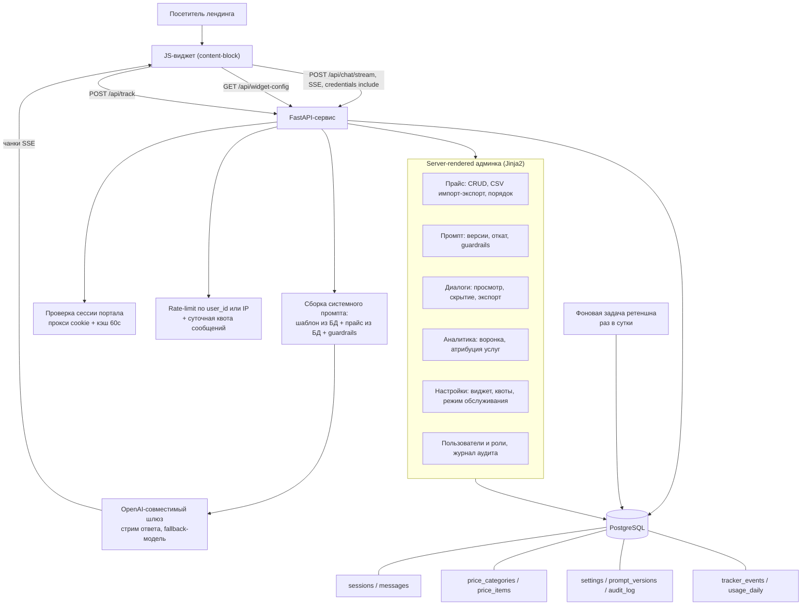

# ИИ-консультант по рекламным услугам (виджет на публичном сайте)

Кейс-стади: встраиваемый чат-консультант, который отвечает посетителям B2B-медиапортала
по каталогу рекламных услуг и передаёт заявку менеджеру. Заказчик и его домены
обезличены; исходный код не публикуется, ниже — разбор архитектуры и решений.

## Коротко

- **Задача:** чат-консультант на сайте B2B-медиапортала: отвечает по каталогу рекламных услуг и ценам, передаёт заявку менеджеру; отдел продаж правит прайс и поведение бота без разработчика.
- **Решение:** сервис на FastAPI со стримингом ответов (SSE) и встраиваемый JS-виджет. Прайс и промпт в PostgreSQL, админка с версиями, откатом и журналом аудита. LLM через OpenAI-совместимый шлюз с запасной моделью, без RAG.
- **Стек:** Python 3.12, FastAPI, SSE, PostgreSQL, SQLAlchemy 2.x async, Alembic, Jinja2, Docker, Kubernetes, GitLab CI.
- **Результат:** сервис в проде (2 реплики, RollingUpdate, пробы). Отдел продаж обслуживает себя сам: прайс, промпт, квоты, аналитика воронки, A/B приветствия. Продуктовые метрики (конверсия, число диалогов) заказчик не фиксировал.
- **Моя роль:** бэкенд, админка, интеграция с LLM-шлюзом, аналитика, деплойная обвязка. Продуктовые решения за заказчиком, конвенции кластера за его платформенной командой.

## 1. Задача и контекст

Портал профессионального сообщества продаёт рекламные размещения (статьи, баннеры,
email-рассылки, соцсети, видео, ведение блога компании). Прайс жил на статической
странице, часть пакетов — в тарифном API портала. Всё, что не находилось на странице
самостоятельно, уходило в почту менеджеру и возвращалось ответом через часы.

Что требовалось:

- консультировать по услугам и ценам в чате прямо на лендинге, а не в почте;
- честно передавать разговор человеку, когда вопрос вне зоны бота (аккаунт, оплата,
  техпроблема) — вместо попыток угадать ответ;
- дать отделу продаж возможность править прайс и поведение бота **без релиза**;
- собирать аналитику: какие услуги вызывают интерес и на каких страницах.

Ограничения, которые определили дизайн:

- бот не должен выдумывать цены и услуги — цена в диалоге приравнивается к оферте;
- виджет живёт на страницах основного сайта, а сервис — отдельное приложение
  (кросс-доменные cookie, CORS, отсутствие общей сессии);
- в кластере нет планировщика задач (CronJob не применить) и нет прав cluster-admin;
- команда сопровождения — менеджеры, не инженеры: всё управление через веб-панель.

## 2. Архитектура

## 3. Стек

| Слой | Технологии |
|---|---|
| Язык / рантайм | Python 3.12 |
| Веб | FastAPI, Starlette SSE (`StreamingResponse`), Jinja2-шаблоны для админки |
| Данные | PostgreSQL 17, SQLAlchemy 2.x (async, `asyncpg`), Alembic — 8 миграций |
| LLM | OpenAI-совместимый шлюз-агрегатор; основная модель `gpt-4.1-mini`, отдельная fallback-модель; ранняя версия работала на `deepseek-v4-flash`/`-pro` |
| Транспорт к LLM | `httpx.AsyncClient` со стримингом `text/event-stream` |
| Аутентификация | админка — bcrypt (passlib) + JWT в httpOnly-cookie; конечные пользователи — проксирование сессии портала |
| Наблюдаемость | структурные логи в stdout + push в Loki, опциональный Sentry, статус-панель ошибок LLM |
| Контейнеризация | Docker (slim-образ, `uv` для установки зависимостей) |
| Оркестрация | Kubernetes: 2 реплики, RollingUpdate, readiness/liveness/startup-пробы, requests/limits, nodeSelector и tolerations |
| CI/CD | GitLab CI на базе шаблона Auto DevOps + Helm values для dev/prod в репозитории; секреты — из CI/CD-переменных, в git не попадают |
| Скрейпинг (первая итерация) | Playwright — разовое снятие прайса со статической страницы в JSON |

Отдельно стоит отметить, чего в стеке **нет**: ни векторной базы, ни RAG, ни очередей.
Каталог услуг — десятки позиций, он целиком укладывается в системный промпт; всё
остальное было бы усложнением без выигрыша.

## 4. Инженерные решения и trade-off'ы

**1. Прайс и промпт как данные в БД, а не как код и файлы.**
Первая итерация читала прайс из JSON, снятого скрейпером, и держала промпт в исходниках.
Это быстро, но каждая правка цены — коммит и деплой. В продовой версии прайс переехал в
таблицы `price_categories`/`price_items` с CRUD, CSV-импортом и сортировкой в админке, а
промпт — в key-value настройки с историей версий, откатом и журналом аудита. JSON остался
в роли сида. Тонкость: сид пропускается, если данные уже есть (прод-БД переживает
деплой), поэтому добавление нового поля (ссылка «подробнее») потребовало отдельного
идемпотентного бэкфилла — он заполняет только пустые значения и никогда не затирает
ручные правки менеджеров. Альтернатива — версионировать прайс в git и деплоить —
отброшена: владельцем контента должен быть отдел продаж, а не разработчик.

**2. Протокол маркеров вместо function calling.**
Бот заканчивает ответ строкой-маркером (`заказать`, `связаться с менеджером`,
`передать в поддержку`), а виджет вырезает маркер и рисует соответствующую кнопку.
Почему не tool calls: нужно было решение, работающее на самой дешёвой модели и на любом
провайдере, без гарантий поддержки инструментов; маркер — это одна строка в промпте и
одно регулярное выражение в виджете. Побочная выгода — маркер сохраняется в тексте
сообщения в БД, и аналитика может атрибутировать клик по кнопке к **тому самому** ответу
бота (событие трекера хранит `message_id`), а не к последней реплике диалога.
Плата: модель иногда пишет маркер там, где не нужно, — это лечится правилами в промпте,
но полностью не устраняется.

**3. Ни своего логина, ни своей сессии для конечных пользователей.**
Сервис проксирует входящий cookie на пользовательский endpoint портала и получает
идентичность. Кэш результата — по `sha256` cookie на 60 секунд, иначе каждое сообщение
чата бьёт в портал. Два неочевидных момента: (а) кэшировать нужно и **отрицательный**
ответ, иначе анонимный и ботовый трафик каждый раз ходит в апстрим с таймаутом и забивает
пул соединений; (б) сетевую ошибку кэшировать нельзя — иначе одна секунда сетевого сбоя
на минуту отключает реально залогиненного пользователя. Хеш именно криптографический:
на коллизии обычного `hash()` два разных пользователя могли бы получить закэшированную
личность друг друга. Есть env-флаг быстрого отката жёсткой проверки — на случай, если
cookie не доезжает до поддомена.

**4. Два HTTP-клиента вместо одного общего.**
Изначально авторизация и стрим LLM делили один `AsyncClient` с большим таймаутом и без
лимитов. При замедлении LLM пул выедался, короткие вызовы авторизации вставали в очередь
на pool-wait, и под «висел» до ручного рестарта. Разделили на клиент коротких служебных
вызовов (read ~10с) и клиент стрима (read ~120с), каждому — явные лимиты соединений.
Тогда же разделили пробы: `/health` для liveness **без обращения к БД** (иначе падение
общей базы перезагрузило бы все поды разом) и `/ready` с реальным `SELECT 1` под
двухсекундным таймаутом — под с исчерпанным пулом выпадает из балансировки и
восстанавливается сам.

**5. Двухуровневое ограничение нагрузки: мягкое в памяти, точное в БД.**
Rate-limit (запросов в минуту на пользователя или IP) — in-memory, с периодической
очисткой словаря, чтобы он не рос по уникальным ключам. Это сознательно «мягкий» лимит:
при нескольких репликах он считается на каждом поде отдельно. Строгий общий лимит требует
Redis, которого в контуре нет, а цена промаха — несколько лишних запросов, не деньги.
Зато суточная квота сообщений на пользователя считается запросом в Postgres по скользящему
окну — она про расход на LLM, и здесь точность важна; при превышении бот отдаёт стримом
дружелюбное сообщение, вообще не обращаясь к модели.

**6. Стабильный ключ подписи JWT без внешнего секрет-хранилища.**
Если `SECRET_KEY` не задан в окружении, каждая реплика сгенерировала бы свой — и JWT,
подписанный одной, отвергался бы другой (пользователя выкидывает из админки, а
RollingUpdate повторяет гонку). Решение: `INSERT ... ON CONFLICT DO NOTHING` в таблицу
настроек на старте и последующее перечитывание — ключ записывается ровно один раз, все
реплики сходятся на одном значении. Это не замена секрет-менеджеру, а безопасный дефолт.

## 5. Что было сложно

- **Reasoning-модели ломают стриминг.** Часть моделей отдаёт `content: null` в дельте,
  весь вывод уходит в поле reasoning — на выходе пустой ответ при формально успешном
  HTTP 200. Пришлось строить цепочку моделей с проверкой «пришёл ли непустой текст» и
  переходом к следующей модели, а не полагаться на статус ответа. Дефолтной осталась
  обычная не-reasoning модель.
- **Жизненный цикл БД-сессии против стрима.** Генератор SSE живёт дольше, чем
  request-scope. Все чтения (промпт, прайс, окно истории) выполняются до старта стрима в
  короткоживущей сессии, а сохранение ответа ассистента — в новой сессии внутри
  генератора. Иначе соединение из пула удерживается всё время генерации.
- **IDOR в публичном API.** Эндпоинт, отдававший историю сессии по UUID, позволял без
  авторизации читать чужую переписку. Он был не нужен ни виджету, ни админке — удалён;
  доступ к истории оставлен только через админку. Владелец сессии проверяется явно:
  существующая сессия переиспользуется только если она ничья или принадлежит этому
  пользователю, иначе создаётся новая.
- **Спам в открытый эндпоинт трекера.** Открытая ручка событий — приглашение засыпать БД
  мусором. Добавлены: whitelist типов событий, проверка существования сессии, rate-limit
  по IP, валидация UUID на уровне схемы (кривой ввод → 422, не 500).
- **Атрибуция услуги к клику.** «Сколько заявок принесла услуга X» — не тривиальный
  запрос: в одном ответе бот может предложить несколько услуг. Событие ссылается на
  конкретное сообщение, матчеры имён услуг строятся по границам слова от самого длинного
  названия, и все найденные в контексте услуги получают засчитанный клик. Тестовые
  диалоги из админ-чата помечаются скрытыми и исключаются из аналитики.
- **Часовые пояса.** Время в БД — UTC, менеджеры живут в московском. Отдельный
  Jinja-фильтр конвертирует значения при рендере; naive-значения трактуются как UTC.
  Без этого вся аналитика показывала бы смещение на три часа.

## 6. Результат

Проверяемое по коду и конфигурации, без домыслов:

- Работающий продовый сервис: 2 реплики, RollingUpdate, три вида проб, requests/limits;
  8 применённых миграций схемы.
- Полный контур самообслуживания для отдела продаж: прайс (CRUD + CSV), промпт с
  версиями и откатом, guardrails, тексты и контакты виджета, рабочие часы, режим
  обслуживания, суточные квоты — всё без участия разработчика.
- Разделение ролей (`admin` / `manager`) и журнал аудита действий: видно, кто и когда
  менял прайс, промпт или настройки.
- Аналитика: воронка диалог → интерес → заявка, разрез по услугам и по страницам-источникам,
  A/B приветствия, экспорт диалогов в JSON и CSV.
- Оценка расхода токенов по дням (по длине текста, ~4 символа на токен) — в коде честно
  помечена как **оценка для индикатора, а не биллинг**.
- Ретеншн диалогов (по умолчанию 90 дней, настраивается, 0 — выключен) фоновой задачей.

Численных продуктовых метрик (конверсия, число диалогов, экономия времени менеджеров)
здесь нет: они не фиксировались в коде или конфигурации, и придумывать их я не готов.

## 7. Роль в проекте

Backend и админка продовой версии, инфраструктурная обвязка (Dockerfile, Helm values,
пробы, ретеншн, логирование), интеграция с LLM-шлюзом и с сессией портала, аналитический
слой. Проект принят с ранней демо-версии (её код сохранён в репозитории отдельной папкой):
из неё унаследованы идея виджета, структура прайса и первый вариант промпта. Конвенции
деплоя (кластер, домены, сертификаты, набор CI/CD-переменных) заданы платформенной
командой заказчика — я следовал им, а не проектировал их. Продуктовые решения (границы
ответственности бота, тексты, политика передачи в поддержку) принимал заказчик.
