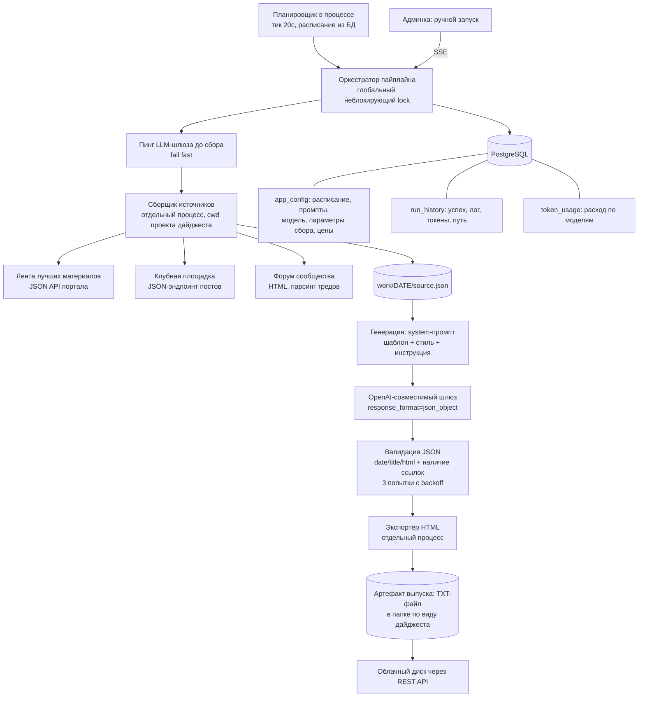

# Пайплайн автоматических дайджестов (daily / weekly)

Кейс-стади: автоматизация редакционного процесса — сбор материалов из нескольких
источников, генерация дайджеста через LLM, экспорт готового к публикации HTML и выкладка
файла в облачное хранилище по расписанию. Заказчик обезличен, исходный код не публикуется.

## 1. Задача и контекст

Редакция крупного профессионального медиа-портала выпускала два регулярных дайджеста:
ежедневный (лучшие материалы дня, живые темы форума сообщества, посты клубной площадки) и
еженедельный (новости недели, сгруппированные по рубрикам: налоги, отчётность, кадры,
проверки, суды и разъяснения). Каждый выпуск собирался руками: пройти по разделам,
выбрать материалы, переписать аннотации, сверстать HTML под CMS, выложить текстовую
версию для рассылки.

Что требовалось:

- воспроизвести редакционный процесс как повторяемый пайплайн с расписанием;
- сохранить редакционный стиль — стилевые правила формулируются в промптах, а не в коде;
- отдавать на выходе **готовый к вставке в CMS HTML** с жёсткой разметкой (у CMS свои
  требования к атрибутам абзацев и структуре секций), а не «просто текст»;
- дать редактору панель: запустить вручную за любую дату, видеть живой лог, историю
  запусков и расход токенов, править промпты и расписание без релиза;
- уметь пережить «тонкий день», когда материалов за сутки меньше нужного минимума.

Ограничение, повлиявшее на архитектуру: у первой версии оркестрация была shell-обёрткой
поверх набора CLI-скриптов, конфигурация — JSON-файлом на диске, а промпты — markdown-файлами
рядом. При переезде в кластер файловое состояние не переживает пересоздание пода, а вместе
с ним терялись бы все правки редактора.

## 2. Архитектура

Ключевая особенность схемы: доменная логика (сбор источников и экспорт HTML) осталась
двумя автономными CLI-программами, которые оркестратор запускает как дочерние процессы с
рабочей директорией соответствующего вида дайджеста. Сервис отвечает за расписание,
конфигурацию, LLM-вызов, публикацию, историю и панель.

## 3. Стек

| Слой | Технологии |
|---|---|
| Язык / рантайм | Python 3.11 |
| Веб / панель | FastAPI, Jinja2, SSE для живого лога, CSRF-проверка на всех POST |
| Планировщик | собственный asyncio-цикл в процессе приложения, `zoneinfo` (московская зона) |
| Данные | PostgreSQL, SQLAlchemy 2.x async + `asyncpg`, Alembic |
| Конфигурация | таблица `app_config` (key → JSON) с типизированными геттерами и сидом дефолтов |
| LLM | OpenAI-совместимый шлюз, модель класса `qwen3.7-plus`, `response_format: json_object`, `max_tokens` порядка 24k |
| Сбор данных | стандартная библиотека (`urllib`, `HTMLParser`) + регулярные выражения, ретраи с экспоненциальной задержкой и джиттером, троттлер запросов |
| Публикация | REST API облачного диска (загрузка файла в папку по виду дайджеста) |
| Аутентификация панели | один общий пароль (bcrypt-хеш) → JWT в httpOnly-cookie, in-process троттлинг неудачных логинов по IP |
| Наблюдаемость | stdout + ротируемый файл + push в Loki |
| Контейнеризация / CI/CD | Docker, GitLab CI (шаблон Auto DevOps), Helm values для dev/prod, секреты через CI/CD-переменные |

## 4. Инженерные решения и trade-off'ы

**1. Сборщики оставлены отдельными процессами, а не переписаны в сервис.**
Логика сбора — это накопленное знание о чужих API и вёрстке: какие поля где лежат, какие
даты в каком формате, где HTML в windows-кодировке. Переписывание её «красиво внутрь
приложения» дало бы регресс без выигрыша. Плюсы решения: доменный код не тронут, его можно
запускать руками для отладки, падение сборщика не роняет веб-процесс. Минусы, которые
пришлось закрывать: управление таймаутами дочерних процессов, отлов зависших и осиротевших
процессов, потоковая передача их вывода в браузер. Именно здесь возникла самая дорогая
ошибка проекта (см. раздел 5).

**2. Конфигурация и промпты — в БД, а не в файлах.**
Расписание, модель и её параметры, параметры сбора (минимум материалов, окно добора,
лимиты на рубрику), папка публикации, цены токенов, шаблон и стилевые промпты — строки
таблицы `app_config`. Дефолты сеются при первом старте, промпты — из markdown-файлов,
входящих в образ. Так правки редактора переживают пересоздание пода, а образ остаётся
самодостаточным для чистого развёртывания. Альтернатива (ConfigMap) отброшена: править
ConfigMap редактор не может, а деплой ради смены времени запуска — плохой процесс.

**3. Планировщик внутри процесса вместо CronJob.**
В кластере нет прав на планировщик задач, поэтому расписание — asyncio-задача, поднимаемая
в lifespan: тик раз в 20 секунд, перечитывание расписания из БД раз в 5 минут (правки из
панели применяются без рестарта), guard от повторного запуска одного и того же момента
времени. Осознанное следствие: приложение живёт в одной реплике, а взаимное исключение
запусков обеспечивается process-wide локом. Тик целиком обёрнут в `try/except` — включая
перечитывание расписания: один плохой тик (битые данные в БД, недоступность базы) не должен
навсегда убить фоновый цикл. Ретеншн-очистка истории вызывается из того же цикла, но не
чаще раза в календарный день.

**4. Fail fast: пинг LLM-шлюза до сбора источников.**
Сбор — это несколько минут сетевых запросов к чужим сайтам. Если апстрим LLM недоступен,
все они выброшены впустую, а ошибка всплывает в конце. Поэтому первый шаг пайплайна —
минимальный chat-запрос (`max_tokens` порядка десятка). Токены пинга не «теряются»: usage
возвращается наружу и попадает в историю наравне с основной генерацией — иначе расход
считался бы неполным.

**5. Контракт с моделью: JSON-объект, валидация и ретраи.**
От модели требуется строго один JSON-объект с полями даты, заголовка и HTML. Слои защиты:
`response_format: json_object` на стороне API; снятие markdown-ограждений и извлечение
объекта по первой `{` / последней `}`, если модель всё же обернула ответ; структурная
валидация, включая проверку, что в HTML **есть хотя бы одна ссылка** (дайджест без ссылок
бесполезен, а модель периодически «забывает» их); три попытки с экспоненциальной паузой;
сырой ответ модели сохраняется на диск до парсинга — без него разбор «почему выпуск не
собрался» превращается в гадание.

**6. Стоимость запуска как продуктовая функция.**
Из ответа API берётся фактический usage и пишется в две таблицы: агрегат по запуску и
детализация по моделям. Рублёвая оценка считается арифметикой по цене за 1M токенов,
которую вводит администратор в панели — сознательно без обращения к внешним прайс-листам,
чтобы не зависеть от их изменений и не выдавать оценку за биллинг.

**7. Санитайзинг ошибок апстрима.**
Тела ошибок внешнего API попадают и в историю запусков, и в SSE-лог в браузере. Они
обрезаются до 500 символов, и из них вычищается всё похожее на bearer-токен, заголовок
авторизации или api-key: провайдер может отразить эхом присланный ключ, и он бы осел в
базе и на экране.

## 5. Что было сложно

- **Дедлок на блокирующем чтении stdout.** Живой лог реализован генератором, который
  читает вывод дочернего процесса построчно. Первая версия проверяла дедлайн *после*
  получения строки — а `for line in proc.stdout` это блокирующий `readline()`. Процесс,
  зависший на сетевом запросе **до первого вывода**, не выдавал ни строки, проверка
  таймаута не срабатывала никогда, и глобальный лок запусков оставался занят навсегда.
  Внешне это выглядело как два подряд неуспешных запуска с нулевым расходом токенов —
  то есть как *следствие*, а сам зависший запуск в историю даже не попал. Починка:
  отдельный поток-читатель, кладущий строки в очередь, и дедлайн через `queue.get(timeout=…)`;
  в `finally` — гарантии на каждый путь выхода, включая `GeneratorExit` (клиент SSE закрыл
  соединение): `terminate()`, затем `kill()`, обязательный `wait()` (иначе остаётся зомби),
  и `join` потока-читателя строго до закрытия пайпа.
- **Асинхронная БД из синхронного потока.** Стриминговый ответ выполняется в
  threadpool'е, а общий engine привязан к главному event loop: `asyncio.run` поднимает
  новый loop, и `asyncpg` падает с «future attached to a different loop». Решение —
  одноразовый engine с `NullPool`, создаваемый внутри нового loop и корректно
  закрывающийся: полноценный пул для одного вызова бессмысленен.
- **Идемпотентность и двойные запуски.** Тик планировщика, наложившийся на ручной
  запуск, двойной сабмит формы или два открытых SSE-стрима означали бы гонку за одни и те
  же рабочие файлы даты — двойную публикацию и двойной расход токенов. Закрыто
  неблокирующим локом: второй запуск не ждёт, а сразу получает понятное сообщение.
  Дата валидируется на входе — иначе ошибка всплывала бы намного позже как невнятный
  `FileNotFoundError` по несуществующему пути.
- **«Тонкие» дни и дедупликация.** Материалов за конкретную дату может не хватить.
  Реализован добор: сначала берутся материалы целевого дня, затем — из окна предыдущих
  дней до нужного минимума, с сортировкой «сначала целевой день, потом по свежести» и
  дедупликацией по идентификатору или URL. Для форума, где нет удобного API, парсинг HTML
  тредов сделан регулярными выражениями с фильтрами (слишком короткие заголовки
  отбрасываются), а при недоборе тредов сборщик возвращает не тишину, а явный статус
  «источник дал меньше нужного» с указанием ручного обходного пути.
- **Чужие API без гарантий.** Ретраи только на осмысленных кодах (429 и 5xx), пауза
  с джиттером (случайная добавка к экспоненте, чтобы не выстраивать запросы в такт),
  троттлер между запросами, декодирование с перебором кодировок (часть страниц отдаётся
  не в UTF-8), защитный разбор дат в пяти форматах.
- **Разметка под CMS.** Экспортёр не просто печатает HTML модели: он нормализует абзацы
  и элементы списков, восстанавливает нужные атрибуты стилей, разделители секций и
  порядок разделов, склеивает устаревший формат ответа с актуальным. Требования CMS
  жёсткие, а модель к концу длинного HTML начинает «терять» атрибуты.

## 6. Результат

Подтверждаемое кодом и конфигурацией:

- Пайплайн из четырёх шагов (сбор → генерация → экспорт HTML → публикация файла)
  работает и по расписанию, и вручную за произвольную дату; расписание по умолчанию —
  ежедневный выпуск в рабочие дни и еженедельный в конце недели, московская зона.
- Панель редактора: ручной запуск с живым логом, история запусков (успех, полный вывод,
  токены, путь публикации), расход токенов и его рублёвая оценка, редактирование
  расписания, промптов, шаблона, параметров сбора и папки публикации, глобальный тумблер
  сервиса, проверка доступа к облачному диску.
- Отказоустойчивость: жёсткий таймаут дочерних процессов (900с), гарантированное
  убийство зависших, неблокирующий лок против параллельных запусков, ретраи с backoff на
  стороне LLM и на стороне сбора, ретеншн истории.
- Ни один провал не остаётся невидимым: любая ошибка превращается в запись истории с
  флагом неуспеха и в понятную строку лога, наружу не утекает голый traceback.

Метрик вида «сколько выпусков собрано», «сколько времени сэкономлено редакции» или
«сколько стоит один выпуск» я не привожу: этих чисел нет в коде и конфигурации, а
восстанавливать их по памяти означало бы выдумывать.

## 7. Роль в проекте

Перенос работающего, но файлового и shell-ориентированного прототипа в сервис: FastAPI,
Postgres как единственное состояние, планировщик в процессе, панель редактора,
SSE-стриминг логов, учёт токенов и стоимости, контейнеризация и деплойная обвязка.
Доменные сборщики и экспортёры HTML портированы почти без изменений — это чужое накопленное
знание об источниках, и оно сохранялось умышленно; стилевые и редакционные промпты
принадлежат редакции. Конвенции кластера и CI/CD заданы платформенной командой заказчика.
