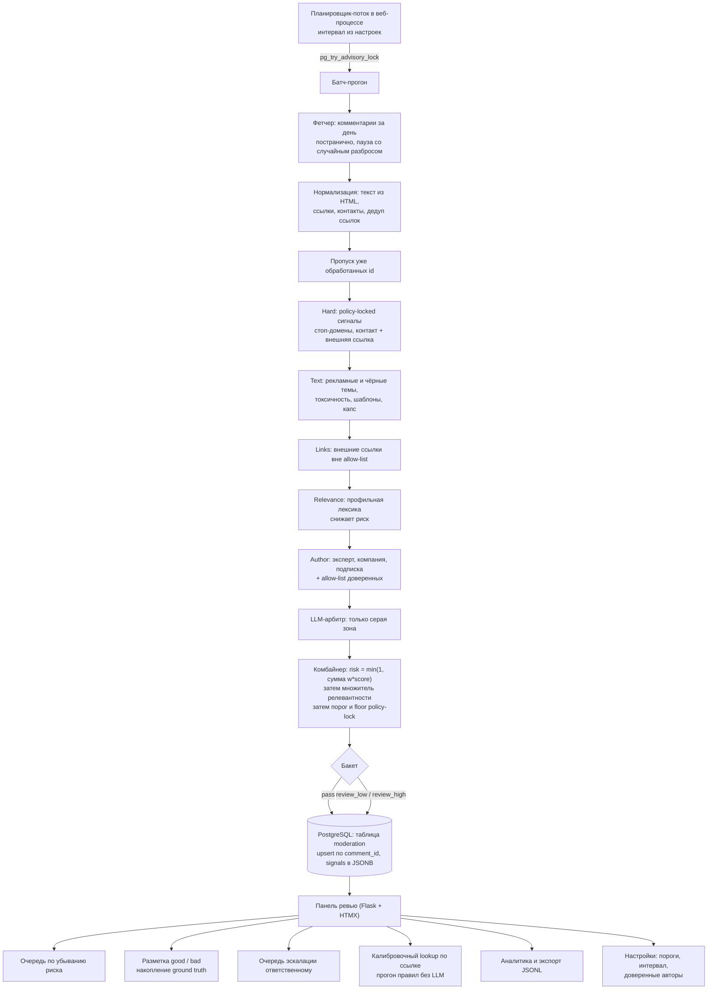

# Модерация комментариев: каскадный классификатор + очередь ревью

Кейс из работы в Клерк.Ру, бухгалтерском портале с около 7 млн визитов в месяц. Я работал там с января по июнь 2026 года единственным AI-разработчиком. Построил систему, которая проверяет комментарии на скрытую рекламу и передаёт подозрительные модератору с объяснением решения.

## Коротко

- **Задача:** находить среди комментариев B2B-портала скрытую рекламу и самопродвижение и передавать подозрительные модератору с объяснением, без автоудалений.
- **Решение:** каскад из шести слоёв (стоп-домены, словари, внешние ссылки, профильная лексика, репутация автора, LLM-арбитр только для серой зоны) считает риск и складывает комментарий в очередь ревью. Пороги и доверенные авторы правятся в панели без релиза.
- **Стек:** Python 3.11, Flask, HTMX, PostgreSQL (psycopg 3), YAML-правила, OpenAI-совместимый LLM-шлюз, pytest, Docker, GitLab CI, Helm.
- **Результат:** контур работает в проде: батч по расписанию, очередь ревью с разложением риска по сигналам, разметка модератором, экспорт в JSONL. 14 файлов тестов без обращения к сети. Цифры точности в кейсе не публикуются.
- **Моя роль:** система целиком: каскад, комбайнер, схема БД, LLM-арбитр, панель ревью, планировщик, тесты, деплой. Словари правил наполнялись вместе с модераторами заказчика.

## Что за задача

На портале Клерк.Ру комментарии открыты всем: под статьями, новостями, в консультациях, блогах компаний и отзывах. Основная проблема: самопродвижение. Ссылки на свои сервисы, телефоны для консультаций, рекрутинг-спам, серые финансовые схемы. Модераторы читали поток вручную. Заказчик решил не делать автоудаления: система классифицирует, решение принимает человек. Нужно было объяснимое решение, которое тюнится без релиза и не ловит ложняки на легитимных сценариях: ответ эксперта со ссылкой на документ ведомства, ответ компании клиенту, вакансии и резюме. Размеченного датасета на старте не было, только правила и здравый смысл.

## Что я сделал

- Собрал каскад из шести слоёв: стоп-домены, текстовые словари, внешние ссылки, профильная лексика, репутация автора и LLM-арбитр для серой зоны. Каждый слой отдаёт мягкий балл, а не жёсткое да или нет.
- Сделал policy-lock поверх LLM: стоп-домен или контакт с внешней ссылкой нельзя отменить вердиктом модели. Доверенные авторы и легитимные разделы, наоборот, снимают подозрение.
- Написал комбайнер: считает итоговый риск и раскладывает его на вклады сигналов, чтобы модератор видел причину срабатывания.
- Поднял очередь ревью на Flask и HTMX: разметка good/bad, экспорт в JSONL, прогон одного комментария по правилам без LLM.
- Спроектировал схему в PostgreSQL с одной таблицей и JSONB для сигналов вместо нескольких таблиц из прошлой итерации.
- Сделал планировщик внутри веб-процесса с advisory-lock Postgres вместо CronJob, чтобы держать две реплики без дублирования прогонов.
- Написал 14 файлов тестов на pytest с фейковым LLM-клиентом, без обращения к сети.

## Что было сложно

Компании отвечали клиентам на странице отзывов шаблонными благодарностями со ссылкой на свой сайт, и для этой страницы такой ответ легитимен. Но те же шаблоны встречались в комментариях к блогам компаний, куда пишет кто угодно: я заметил, что под тем же алиби прятался чужой спам, сторонний сервис рекламировался в комментариях к чужому блогу. Алиби стало применяться только если сработал текстовый сигнал благодарности, а не по факту раздела.

Один мессенджер был в стоп-списке доменов, пока в нём не появился официальный канал ведомства, и сразу всплыло ложное срабатывание на ответе эксперта. Я убрал домен из стоп-списка, а спам-каналы в том же мессенджере продолжают ловиться текстовыми фразами продвижения. Вывод: жёсткие правила самые сильные и самые хрупкие к изменениям снаружи.

LLM иногда оборачивал ответ в markdown-ограждения вместо чистого JSON, и парсер сначала падал на этом. Я добавил снятие ограждений: не-объект в ответе трактуется как ошибка, а не как вердикт. Исключение в любом слое каскада не роняет весь батч: слой отдаёт сигнал error, прогон продолжается.

## Результат

Система работает в проде: батч по расписанию, каскад из шести слоёв, очередь ревью с разложением риска, разметка модератором, экспорт в JSONL. Дефолтные пороги в коде: review_high 0.65, review_low 0.30, коэффициент релевантности 0.5, все три правятся в панели без релиза. Две реплики работают с RollingUpdate благодаря advisory-lock в Postgres. Написано 14 файлов тестов, около 2,5 тысяч строк, без обращения к сети. Цифры точности и доли отловленного спама в кейсе не публикуются.

## Моя роль

Я спроектировал и построил систему целиком: каскад, комбайнер, схему БД, LLM-арбитра, панель ревью, планировщик и тесты. Словари правил я наполнял вместе с модераторами заказчика: они читают поток каждый день, и калибровка порогов шла по их фидбэку. Решение не делать автоудаления приняла компания.

Подробный технический разбор: архитектура, решения и их цена, инциденты

## 1. Задача и контекст

На портале профессионального сообщества комментарии открыты всем: под статьями,
новостями, в разделе консультаций, в блогах компаний, на страницах отзывов. Основная
проблема — самопродвижение: ссылки на свои сервисы, телефоны «обращайтесь за
консультацией», приглашения в свои каналы, рекрутинг-спам, схемы серых финансовых услуг.
Модераторы читали поток вручную.

Требования, которые задали форму решения:

- **никаких автоудалений.** Заказчик прямо решил оставить человека в контуре: система
  классифицирует и складывает в очередь, удаляет модератор;
- решение должно быть **объяснимым**: модератор видит, какие сигналы сработали и с каким
  весом, иначе он не доверяет очереди и перепроверяет всё;
- **тюнинг без релиза**: пороги, интервал прогонов, включение LLM, список доверенных
  авторов правятся в панели;
- нельзя ловить ложняки на легитимных для этой площадки сценариях: подтверждённый эксперт
  отвечает со ссылкой на официальный документ ведомства; компания отвечает своему клиенту
  на странице отзывов о себе; резкое политическое высказывание (грубость — не реклама и не
  зона этой системы); вакансии и резюме по профилю; ссылка на бесплатный сторонний
  инструмент как ответ на конкретный вопрос;
- размеченного датасета на старте не было — только правила и здравый смысл.

## 2. Архитектура

## 3. Стек

| Слой | Технологии |
|---|---|
| Язык | Python 3.11+, пакет с `src`-layout, две точки входа (CLI батча и веб-панель) |
| Веб-панель | Flask + HTMX + серверные Jinja2-шаблоны и один CSS-файл (сознательно без Node и SPA) |
| Прод-сервер | gunicorn, 1 воркер + потоки; масштабирование репликами |
| Данные | PostgreSQL (`psycopg` 3), одна таблица очереди, `JSONB` для пофазового разбора сигналов, частичный индекс для неразмеченной очереди |
| Правила | YAML-конфиг: allow/deny домены, тематические словари, шаблонные фразы, профильная лексика |
| LLM | OpenAI-совместимый шлюз, модель класса `gpt-4.1-mini`, `temperature=0`, `max_tokens≈100`, ответ строго JSON |
| Источник данных | JSON API портала (комментарии за дату, постранично) |
| Планировщик | поток внутри веб-процесса + advisory-lock Postgres вместо CronJob |
| Тесты | pytest, 14 файлов (~2,5 тыс. строк), включая фейковый LLM-клиент — сеть в тестах не нужна |
| CI/CD, оркестрация | Docker, GitLab CI (Auto DevOps), Helm values, 2 реплики, RollingUpdate, пробы, requests/limits |

## 4. Инженерные решения и trade-off'ы

**1. Каскад «мягких» баллов вместо одного LLM-вызова на каждый комментарий.**
Каждый слой выдаёт `spam_score ∈ [0,1]`, комбайнер складывает их с настраиваемыми весами
и обрезает на 1.0, порог переводит число в бакет. Альтернативы: (а) отправлять каждый
комментарий в LLM — дорого при потоке комментариев и непредсказуемо по стабильности
решений; (б) обучить классификатор — нечем, разметки на старте нет. Выбранный вариант
объясним по построению: в UI показывается разложение риска по вкладам (строка формата
«совокупный риск N% — и три сильнейших вклада с их процентами»), правила лежат в YAML
и правятся редактором, а LLM тратится
только на серую зону. Плата — калибровка весов и порогов руками; поэтому пороги вынесены
в настройки, а в панели есть инструмент прогона одного комментария по правилам без LLM,
чтобы видеть причину срабатывания мгновенно и бесплатно.

**2. Policy-lock против вето: две стороны одной медали.**
LLM-арбитр — не последняя инстанция, а участник. Вердикт `clean` **обнуляет** мягкие
текстовые и ссылочные баллы (это вето), но не может отменить policy-locked сигналы:
домен из стоп-листа, «контакт + внешняя ссылка», фишинговый паттерн «перейдите по ссылке
и авторизуйтесь». Такое срабатывание вдобавок поднимает итог до минимального бакета
`review_high` независимо от арифметики (floor). Симметрично работает алиби: доверенный
автор из allow-list, комментарий на странице отзывов о самой компании — обнуляют мягкие
сигналы и **отменяют вердикт `spam`** от модели. Смысл: одна и та же фраза законна в одном
разделе и реклама в другом, а решение о том, какие сигналы неотменяемы, должен принимать
администратор, а не модель.

**3. Релевантность как множитель, а не как отрицательный балл.**
Профильная лексика и вопросительная форма — это «текст как алиби»: он снижает риск
пропорционально (`risk *= 1 − K_rel · relevance`), а не вычитается из суммы. Причина:
вычитание позволило бы замаскировать явный спам, добавив к нему абзац профессиональных
терминов. Дополнительно множитель применяется **только если в комментарии нет контактов
и внешних ссылок** — алиби не работает против жёстких сигналов. Слой репутации автора
устроен так же: он умеет только снижать риск, никогда не повышать.

**4. Стоимостные гейты перед LLM.**
Модель не вызывается, если (а) уже есть policy-locked сигнал — floor всё равно даст
`review_high`, и вердикт был бы проигнорирован; (б) сумма мягких баллов ниже нижней
границы серой зоны и нет форс-триггера (контакт, внешняя ссылка, голый домен, коммерческая
или продвигающая лексика). Отдельно важна дедупликация: прогон повторяется каждые
несколько десятков минут и снова получает «сегодняшние» комментарии; без пропуска уже
сохранённых каждый серый комментарий уходил бы в модель на каждом тике. Осознанное
ограничение, зафиксированное в коде: отредактированный комментарий повторно не
модерируется — после первого прогона он считается обработанным.

**5. Контекст в промпте вместо «угадай по тексту».**
В запрос к модели кладутся раздел сайта (консультации, отзывы компании, новости, блог,
пользовательский пост, личный кабинет обучения), заголовок материала и краткое описание
автора (подтверждённый эксперт, место работы, должность). Без контекста модель массово
помечает как рекламу профессиональный совет, вакансию и техподдержку площадки. В промпте
явно перечислены не-спам-сценарии и правило «сомневаешься — clean»: цена ложного
срабатывания (модератор тратит время, автор теряет комментарий) выше цены пропуска,
потому что за пропуском всё равно стоит человек.

**6. Планировщик в веб-процессе + advisory-lock вместо CronJob.**
Прав на объекты уровня кластера нет, а всё состояние и так в Postgres. Поток внутри
процесса тикает по интервалу из настроек; перед прогоном берётся `pg_try_advisory_lock` с
фиксированным ключом — прогон выполняет та реплика, что взяла лок, остальные пропускают
тик. Это позволило держать две реплики (HA и RollingUpdate без простоя) без риска задвоить
прогон и без внешнего планировщика. Настройки читаются на каждом цикле, поэтому оператор
включает или выключает планировщик и меняет интервал без редеплоя.

**7. Одна таблица вместо «зоопарка».**
Предыдущая итерация хранила прогоны, использование модели и результаты в нескольких
таблицах. Осталась одна: upsert по `comment_id`, все сигналы — в `JSONB`, `PASS` тоже
пишется (аудит и статистика), решение модератора (`good`/`bad`) — отдельные поля, которые
upsert прогона **не затирает**. Частичный индекс по бакету и убывающему риску с условием
«ещё не размечено» отдаёт очередь одним запросом. Побочный эффект, который был целью:
разметка модератора превращается в накапливаемый ground truth и выгружается JSONL для
последующей калибровки.

## 5. Что было сложно

- **Ложные срабатывания на «спасибо за отзыв».** Компании отвечают клиентам шаблонными
  благодарностями, иногда со ссылкой на свой сайт. Для страницы отзывов о компании это
  общее алиби. Но такие же ответы встречаются в комментариях к посту в блоге компании — а
  туда пишет кто угодно, и выдать алиби всем комментариям блога значит спрятать реальный
  чужой спам под чужим постом (наблюдалось: сторонний сервис рекламировался в комментариях
  к блогу другой компании). Компромисс: алиби на блог выдаётся **только** если сработал
  текстовый сигнал шаблонной благодарности — не как общее правило раздела.
- **Стоп-лист домена, который перестал быть стоп-листом.** Один мессенджер был в
  policy-locked deny-списке, пока в нём не появился официальный канал ведомства: сразу
  всплыл подтверждённый ложняк на ответе эксперта. Домен убран из deny, но спам-каналы в
  том же мессенджере продолжают ловиться текстовыми фразами продвижения. Вывод, который я
  унёс: policy-lock — самый сильный инструмент, и он же самый хрупкий к изменениям внешнего
  мира; каждое такое правило нужно датировать и пересматривать.
- **Тема, которая сама по себе не сигнал.** Упоминание серой финансовой схемы встречается
  и в легитимном обсуждении рисков («нельзя обналичить средства со специального счёта»).
  Поэтому такие темы вынесены в отдельный словарь и оцениваются **только в комбинации** с
  маркером предложения услуги, в отличие от однозначно чёрных тем.
- **Комбо-эскалация.** Отдельно «коммерческая лексика» и отдельно «ссылка» — слабые
  сигналы; вместе они почти всегда реклама. Реализовано как виртуальный вклад в сумму
  (комбинация «коммерция + ссылка или контакт»), а не как правка весов слоёв: так проще
  объяснить и проще откатить.
- **Рабочая ссылка на комментарий.** Модератор должен попадать не на статью, а на сам
  комментарий. Формат якоря пришлось выяснять эмпирически (двойное подчёркивание вместо
  одинарного — с одинарным страница не прокручивается), и он хранится в БД дословно.
  Мелочь, без которой инструмент не используется.
- **Устойчивость к внешним отказам.** Исключение в любом слое не роняет батч: слой
  отдаёт сигнал `error`, каскад продолжается. Ошибка LLM — это `pass` с нулевым баллом,
  то есть уже собранные мягкие сигналы продолжают определять бакет (а не «всё чисто» и не
  падение прогона). Фетчер при 403/429 аккуратно завершает цикл, а не долбит API; между
  страницами — пауза со случайным разбросом.
- **JSON от модели.** Модели периодически оборачивают ответ в markdown-ограждения —
  парсер их снимает; не-объект в ответе трактуется как ошибка, а не как вердикт.

## 6. Результат

Проверяемое по коду, конфигурации и тестам:

- Работающий контур: батч по расписанию → каскад из шести слоёв → очередь ревью с
  объяснением риска → разметка модератором → накопление размеченных данных с экспортом
  JSONL.
- Дефолтные пороги в коде: `review_high = 0.65`, `review_low = 0.30`, коэффициент
  релевантности `0.5`; все три правятся в панели с валидацией (нижний порог не может
  превысить верхний, интервал прогонов ограничен разумным диапазоном).
- Две реплики с RollingUpdate при in-process планировщике — задвоение прогонов исключено
  advisory-локом, внешний планировщик не нужен.
- Fail-closed по безопасности: панель недоступна, пока не заданы логин, пароль и секрет
  подписи cookie; secure-cookie включается флагом для прода.
- 14 тестовых файлов (~2,5 тыс. строк): слои, комбайнер, вето и floor, sink и очередь,
  парсинг фетчера, нормализация, планировщик, настройки, веб-панель. Тесты не требуют
  сети; тесты, зависящие от Postgres, поднимают БД или помечаются как skipped.
- Инструмент калибровки: прогон произвольного комментария по правилам без обращения к
  модели — бесплатный ответ на вопрос «почему это (не) помечено».

Чего здесь **нет** и не будет: процентов точности, доли отловленного спама, числа
комментариев в сутки. Отдельный внутренний анализ чувствительности проводился, но его
числа не относятся к публикуемому кейсу, и приводить их по памяти я не буду.

## 7. Роль в проекте

Проектирование и реализация каскада, комбайнера, слоёв, sink'а и схемы БД, LLM-арбитра с
контекстом площадки и стоимостными гейтами, панели ревью на Flask + HTMX, планировщика с
advisory-локом, деплойной обвязки и тестов. Правила в YAML — совместная работа с
модерацией заказчика: словари тем, шаблонных фраз и доверенных авторов наполняются людьми,
которые читают поток каждый день; калибровка порогов шла по их фидбэку. Продуктовое
решение «никаких автоудалений» принадлежит заказчику, и архитектура оставляет авто-действие
расширением на будущее (отдельная реализация sink'а), а не выключенной функцией.

