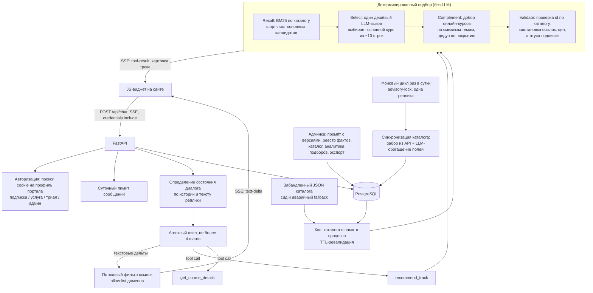

# ИИ-подбор учебных треков: детерминированный движок + разговорный слой

Кейс-стади: сервис, который в диалоге собирает пользователю персональный учебный трек из
каталога онлайн-школы — основной курс с документом плюс дополняющие онлайн-курсы — и при
этом физически не может выдумать курс, цену или ссылку. Заказчик обезличен, исходный код
не публикуется.

## Коротко

- **Задача:** чат-сервис для онлайн-школы, который в диалоге подбирает учебный трек (основной курс плюс 3–7 дополняющих) из каталога в сотню программ и не может выдумать курс, цену или ссылку.
- **Решение:** подбор делает детерминированный движок без LLM: свой BM25 по каталогу, валидатор подставляет названия, цены и ссылки только из базы. Модель ведёт диалог и вызывает инструменты, ссылки в ответе фильтруются по allow-list доменов.
- **Стек:** Python 3.11, FastAPI, SSE, PostgreSQL, SQLAlchemy 2.x async, собственный BM25, function calling, pytest, Docker, GitLab CI.
- **Результат:** три независимых рубежа против галлюцинаций. Eval-харнесс падает, если top-1 hit-rate ниже 0.8 или внедоменный запрос перестаёт отклоняться. Контур подбора покрыт тестами без сети. Продуктовых метрик (конверсия в оплату) в кейсе нет.
- **Моя роль:** перенос агента с TypeScript внутри монолита на самостоятельный Python-бэкенд целиком: движок, диалоговый слой, фильтр ссылок, БД, синхронизация каталога, админка, тесты, деплой.

## 1. Задача и контекст

Онлайн-школа при профессиональном медиа-портале держит каталог примерно из сотни программ
двух принципиально разных типов: длинные программы повышения и переподготовки квалификации
(с выдачей документа, не входят в подписку) и короткие онлайн-курсы (в основном по
подписке). Пользователь, зашедший на сайт, не знает, что ему нужно: он формулирует «хочу
разобраться в управленческом учёте» или «я веду несколько клиентов и хочу вырасти в
профессии».

Что требовалось:

- вести диалог, а не выдавать поисковую выдачу: уточнить роль, уровень, цель, нужен ли
  официальный документ;
- собрать **трек**: один основной курс плюс 3–7 дополняющих онлайн-курсов, не
  дублирующих его содержание;
- никогда не выдумывать факты: id, название, ссылка, цена, статус «входит в подписку»,
  количество академических часов — только из каталога;
- уметь дорабатывать трек по просьбе («добавь про налоги», «поменяй акцент») и объяснять
  уже собранный трек, не пересобирая его каждый раз;
- жить как отдельный бэкенд для встраиваемого виджета: свой деплой, своё масштабирование,
  без зависимости от фронтенд-приложения портала.

Ограничения:

- сервис не имеет собственного логина — доступ определяется профилем пользователя на
  портале (подписка, активная услуга, административная роль, триал для новичков);
- каталог живёт во внешнем API портала, но части полей, критичных для подбора (уровень,
  предварительные требования, компетенции, смежные темы), там просто нет;
- в кластере нет планировщика задач — обновление каталога нужно встраивать в процесс;
- сервис исторически был TypeScript-агентом внутри монолитного Next.js-приложения; задача
  включала перенос на самостоятельный Python-бэкенд с сохранением поведения.

## 2. Архитектура

## 3. Стек

| Слой | Технологии |
|---|---|
| Язык | Python 3.11+ |
| Веб | FastAPI, SSE (`StreamingResponse`), Jinja2-админка |
| Данные | PostgreSQL, SQLAlchemy 2.x async + `asyncpg`, Alembic — 7 миграций |
| Поиск / ранжирование | собственный field-weighted BM25 (IDF, нормализация длины, веса полей), лёгкий инфлекционный стеммер, стоп-словарь |
| LLM | OpenAI-совместимый шлюз, модель класса `gpt-4.1-mini`; function calling для двух инструментов; отдельная (возможно другая) модель на стадию выбора основного курса |
| Аутентификация | проксирование сессии портала; своя админка на bcrypt + JWT в cookie, роли |
| Тесты | pytest: golden-кейсы планировщика, юнит-тесты скоринга, eval-харнесс с ассертами на метрики, тесты санитайзера ссылок, состояния диалога, цен, контекста пользователя — всё без БД и без сети |
| Контейнеризация / CI-CD | Docker (миграции в entrypoint), GitLab CI (Auto DevOps), Helm values dev/prod |
| Наблюдаемость | stdout + push в Loki, лог рекомендаций и расхода токенов в БД |

## 4. Инженерные решения и trade-off'ы

**1. Ответственность разделена по степени детерминированности.**
Подбор курсов — чистые функции без сети и без LLM: их можно тестировать, они быстрые и не
галлюцинируют. LLM отвечает за то, чего не умеет код: понять размытую формулировку, задать
уточняющий вопрос, объяснить трек словами, решить, **когда** вызвать инструмент. Модель
никогда не передаёт данные курса — только идентификаторы; канонические названия, ссылки,
цены, признак подписки и часы подставляет валидатор из каталога, а при несоответствии
возвращает модели список проблем, чтобы она исправила вызов. Это архитектурная защита от
галлюцинаций: соврать в карточке трека модели просто нечем.

**2. Аддитивный подсчёт совпадений заменён на BM25 — и это была не «оптимизация».**
Первая версия скоринга складывала совпадения токенов без нормализации. На генерик-запросах
это массово давало ничьи: несколько курсов с одинаковым баллом, и победителя определял
порядок каталога, а не релевантность. Field-weighted BM25 (IDF плюс нормализация длины
документа) разводит частые и редкие термины естественным образом. Веса полей вместо
отдельного «title boost»: токен из названия попадает в частоту с трёхкратным весом, поэтому
при равной документной частоте доминирует над совпадением во второстепенных полях, но сама
документная частота остаётся честной. Порог минимальной релевантности отсекает случайные
лексические пересечения — при нулевой релевантности лучше честно ничего не найти, чем
отдать случайный хвост каталога.

**3. Лёгкий стеммер вместо морфологической библиотеки.**
Русские словоформы («налог / налоги / налогов / налогах») нужно сводить к одному стему, но
«управление» и «управленческий» — разные слова с разным смыслом, и старая эвристика
«общий префикс ≥60%» их путала. Решение: детерминированное срезание одного частотного
падежного окончания, суффиксы отсортированы по убыванию длины, минимальная длина стема
защищает короткие термины и аббревиатуры, токены с цифрами не трогаются вовсе. Плюс —
никакой тяжёлой зависимости и полная предсказуемость; минус — стеммер грубее полноценной
морфологии, и его границы приходится держать под eval-тестами. Стоп-слова — не служебные
части речи, а «мусор каталога»: слова, встречающиеся в большинстве курсов и потому не
различающие тематику; при этом значимые специализирующие термины в стоп-лист сознательно
не попали — их разводит IDF.

**4. Retrieve → LLM-select → Validate вместо «LLM выбирает по каталогу».**
Полноту даёт детерминированный recall (около десяти кандидатов в основной курс, при
скудном результате — второй проход с расширенным запросом). Точность даёт один дешёвый
LLM-вызов, который видит **не каталог, а десяток компактных строк** и выбирает только
основной курс — с учётом того, что регулярками не поймать: заявленный уровень, явный отказ
пользователя от варианта, преемственность с уже начатым курсом. Добор онлайн-курсов остаётся
детерминированным: он идёт по редакционным «смежным темам» основного курса и отбрасывает
кандидатов, чьё содержание почти целиком покрыто основным. Так LLM-вызов остаётся дешёвым
(десятки строк контекста), а состав трека — воспроизводимым.

**5. Фильтр ссылок как второй рубеж после промпта.**
Промпт запрещает выдумывать URL, но промпт обходится. Поэтому ответ модели проходит через
allow-list доменов: markdown-ссылка на посторонний домен заменяется своим текстом, голый
URL вырезается. Фильтр работает **потоково**, чанк за чанком, иначе выдуманная ссылка
«протекла» бы в интерфейс по кусочкам до финальной проверки; хвост придерживается и
досдаётся в конце. Allow-list расширяется доменами из редактируемого в админке реестра
фактов — то, что менеджмент добавил как канонические ссылки, разрешено автоматически.

**6. Гейтинг по состоянию диалога.**
Состояние выводится из истории и текущей реплики: собрать профиль, уточнить необходимость
документа, собрать трек, объяснить существующий, переработать, рассказать про содержание
курса. Без этого агент пересобирал трек на каждый вопрос («а сколько это часов?» →
новый трек). Отдельная тонкость: вопрос про официальный документ задаётся один раз за
диалог — маркер того, что он уже звучал, ищется по всей истории ассистента, а сигналы
«документ нужен / не нужен» — по всей истории пользователя, а не по последней реплике.
Агентный цикл ограничен четырьмя шагами: без лимита модель способна ходить по инструментам
кругами.

**7. Каталог: БД как источник истины, память как рабочая копия, JSON как страховка.**
Скоринг обращается к каталогу синхронно из памяти процесса (TTL-ревалидация из БД),
поэтому подбор не делает запросов к базе. Забандленный JSON служит и сидом при первом
развёртывании, и аварийным fallback: при пустой или недоступной БД агент продолжает
работать, а не отдаёт ошибку. Обновление каталога — фоновый цикл раз в сутки под
postgres-advisory-локом (в кластере нет планировщика, а тяжёлый прогон с обращением к API и
LLM-обогащением должна выполнять одна реплика), плюс ручная ручка для принудительного
запуска.

**8. LLM-обогащение каталога как отдельный офлайн-этап.**
Уровень, компетенции, смежные темы, краткое резюме, отличия — этих полей нет в исходном
API, но без них скоринг слеп. Они генерируются моделью на этапе синхронизации и хранятся в
БД как данные, которые администратор может править и «залочить» от перезаписи. Ключевое
разделение: обогащение (медленное, дорогое, ревьюируемое) происходит вне пользовательского
запроса, а в рантайме используется уже проверенный результат.

## 5. Что было сложно

- **Преемственность трека между ходами.** Чтобы «добавь про налоги» дорабатывало
  существующий трек, а не собирало новый, нужно восстановить прошлый результат инструмента
  из сохранённой истории сообщений: обход от последнего сообщения к первому, поиск успешного
  вызова, извлечение основного курса и списка онлайн-курсов. Плюс «пин» основного курса:
  если пользователь уже учится, движок не переподбирает основной вопреки скорингу.
- **Анти-эхо.** Пользователь называет цифру «по памяти» («там же 120 часов?»), и модель
  охотно соглашается. Чтобы этого не происходило, в служебную сводку истории кладутся
  правдивые факты по курсам трека (ссылка, часы) — модели есть с чем сверяться, кроме слов
  пользователя. Тот же приём закрывает «дай ссылку на курс»: без ссылки в сводке модель
  сочиняет правдоподобный URL на разрешённом домене, и доменный фильтр его пропустит.
- **Жизненный цикл БД-сессии при стриминге.** Request-scoped сессия закрывается сразу
  после возврата ответа, а генератор SSE живёт дольше и в конце пишет в БД (сообщения, лог
  рекомендации, расход токенов). Пришлось открывать отдельную сессию на время стрима.
- **Артефакты вывода модели.** Некоторые модели вставляли в русский текст смешанные
  кириллице-латинские склейки («онлайн-cursы»). Санитайзер сознательно консервативен:
  трогает только смешанные токены, не касается чисто латинских терминов, токенов с цифрами
  и защищённого списка аббревиатур.
- **Регрессии ранжирования.** «Пять правок — и всё разъехалось» — реальная проблема
  ручной калибровки скоринга. Ответ: golden-кейсы (фиксированные сценарии с ожидаемым
  основным курсом) и eval-харнесс на размеченном наборе, который считает агрегатные метрики
  и **ассертит пороги**, чтобы частичная деградация не проскользнула в зелёный прогон.
- **Правила доступа.** Доступ и лимиты определяются профилем на портале: администратор —
  без лимита, подписка или активная услуга — полный доступ с суточным лимитом, новичок —
  небольшой триал, остальные — отказ. Логика опирается на внешний ответ, который нужно
  разбирать защитно; dev-режим позволяет подставить cookie локально, и эта ветка жёстко
  выключена в production.
- **Ошибки как контракт для виджета.** Типизированные коды вида `тип:поверхность`
  (rate limit, forbidden, not found, database) с отдельной политикой видимости: детали
  внутренних сбоев уходят только в лог, клиент получает общее сообщение.

## 6. Результат

Проверяемое по коду и тестам:

- Полный контур подбора работает без БД и без сети в тестах: golden-сценарии (несколько
  профилей пользователей плюс проверка стабильности «пина» основного курса), юнит-тесты
  стемминга, IDF-индекса, ранжирования и фильтра по подписке.
- Eval-харнесс с жёсткими ассертами в тестовом наборе: прогон падает, если на размеченном
  наборе запросов top-1 hit-rate опускается ниже 0.8, если появляется грубый мисроут
  (запрещённый для кейса основной курс) или если хотя бы один вне-доменный запрос перестаёт
  честно отказывать. Это не «точность продукта», а защитная сеть от регрессий — и она
  выполняется на каждом прогоне тестов.
- Гарантии состава трека: основной курс нужного типа плюс от 3 до 7 онлайн-курсов,
  дедупликация по покрытию содержания, цена показывается только для курсов вне подписки.
- Анти-галлюцинационный контур из трёх независимых уровней: модель передаёт только id →
  валидатор подставляет канонические данные → потоковый фильтр вырезает ссылки на
  неразрешённые домены.
- Эксплуатационная автономность: сид каталога при пустой БД, суточная синхронизация под
  advisory-локом, аварийный fallback на забандленный каталог, ретеншн-очистка диалогов,
  админка с версиями промпта, реестром фактов, аналитикой подборов и экспортом.
- Лог каждой собранной рекомендации (интент, состояние диалога, нормализованный запрос,
  id курсов, признак успеха и список проблем) — основа для анализа качества подбора.

Продуктовых метрик (сколько треков собрано, конверсия в оплату, влияние на выручку школы)
не привожу: их нет в коде, а гадать о них в портфолио бессмысленно.

## 7. Роль в проекте

Перенос агента с TypeScript-стека внутри монолитного приложения на самостоятельный
Python-бэкенд: движок подбора, скоринг, планировщик трека, стадия выбора, валидатор,
разговорный слой с ручным агентным циклом и SSE, санитайзер и фильтр ссылок, схема БД и
миграции, синхронизация и обогащение каталога, админка, тесты и eval-обвязка, деплойная
конфигурация. Исходная продуктовая логика (структура трека, разделение типов курсов,
редакционные «смежные темы») и содержимое каталога принадлежат заказчику; часть решений
(например, разделение труда между движком и моделью в текущем виде) вырабатывалась
итеративно вместе с заказчиком по результатам эвалов. Конвенции кластера и CI/CD — от
платформенной команды.
