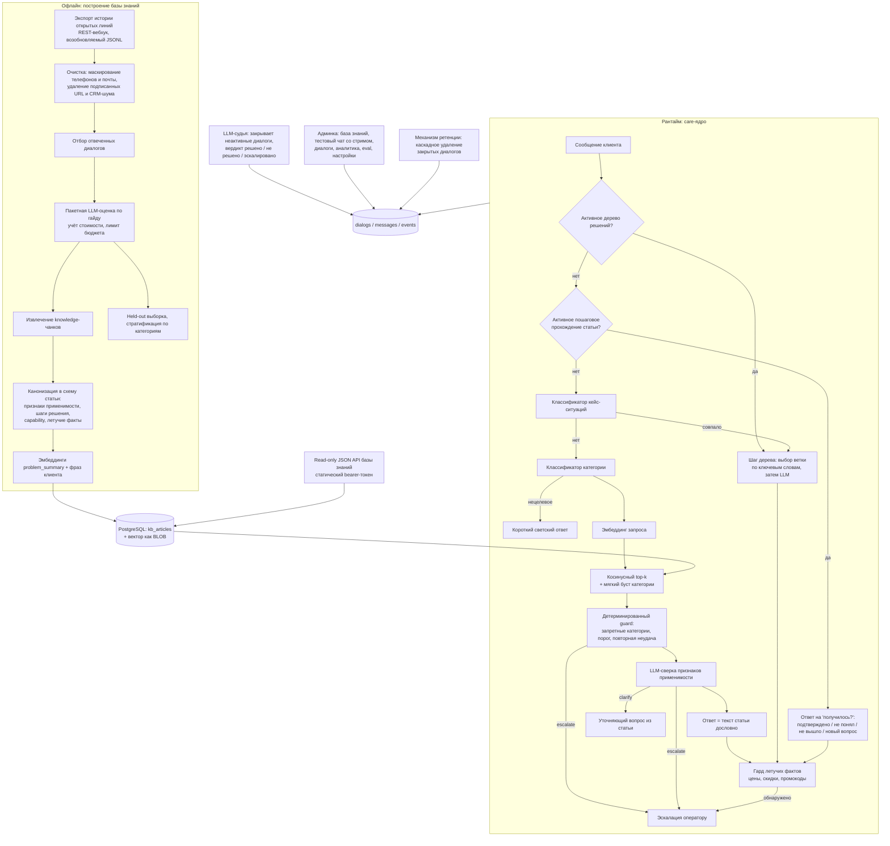

# Бот поддержки для открытых линий Битрикс24: база знаний из реальных диалогов

Кейс-стади: бот первой линии поддержки, база знаний которого построена не из регламентов,
а из истории реальных переписок операторов; отвечает текстом статьи дословно и эскалирует,
когда не уверен. Заказчик обезличен, исходный код и данные обращений не публикуются.

## Коротко

- **Задача:** автоматически отвечать на повторяющиеся обращения клиентов в поддержке Битрикс24, а сложные и чувствительные вопросы сразу передавать оператору.
- **Решение:** офлайн-пайплайн строит базу знаний из истории реальных переписок операторов (с обезличиванием). Рантайм подбирает статью векторным поиском, проверяет применимость и отвечает её текстом дословно, при неуверенности эскалирует человеку. Админка: база знаний, тестовый чат, аналитика.
- **Стек:** Python 3.11, FastAPI, PostgreSQL, SQLAlchemy 2.x async, Alembic, numpy, OpenAI-совместимый LLM-шлюз, pytest, Docker, GitLab CI.
- **Результат:** пайплайн базы знаний, ядро маршрутизации, деревья решений, судья, админка и внешний API готовы, выгрузка истории из Битрикс24 работает. Канал открытых линий на момент разбора не запущен, цифр на реальном трафике нет.
- **Моя роль:** исследование данных, пайплайн базы знаний, ядро, админка, API, схема БД, тесты и деплой. Границы автоматизации и критерии оценки задавал заказчик.

## 1. Задача и контекст

Центр поддержки образовательного направления медиа-портала обрабатывает поток обращений в
открытых линиях Битрикс24: доступ к подписке, вход в личный кабинет, документы об обучении,
записи вебинаров, отписка от рассылок, налоговый вычет, сбои на сайте, оплаты и возвраты.
Значительная часть обращений повторяется, и операторы отвечают на них по сути одинаково.

Что требовалось:

- отвечать на типовые обращения автоматически, оставаясь в Битрикс24 (пилот — внутри
  открытых линий, свой виджет и мультиагентность — следующие этапы);
- строить базу знаний **из реальных диалогов**, а не из придуманных FAQ: только так
  формулировки совпадают с тем, как проблему описывает клиент;
- жёсткое ограничение заказчика: бот не сочиняет ответы. Текст решения — из статьи базы
  знаний, дословно. Модель используется для маршрутизации, а не для генерации;
- никогда не отвечать в чувствительных категориях (жалобы, оплаты и возвраты, удаление
  аккаунта) — там сразу человек;
- честно эскалировать, если статья не найдена или ответ требует данных, которых у бота нет;
- дать заказчику панель: база знаний с редактированием и переиндексацией, тестовый чат,
  диалоги, аналитика, а также программный доступ к базе знаний для своих инструментов.

Ограничения: персональные данные в транскриптах; неопределённая на момент разработки
политика хранения; отсутствие у бота доступа к внутренним read-only API портала (часть
операторских ответов принципиально невоспроизводима ботом).

## 2. Архитектура

Две отчётливо разные половины: офлайн-пайплайн подготовки базы знаний и рантайм-сервис.

## 3. Стек

| Слой | Технологии |
|---|---|
| Язык | Python 3.11+ |
| Веб | FastAPI, Jinja2-админка (server-rendered, без SPA) |
| Данные | PostgreSQL, SQLAlchemy 2.x async + `asyncpg`, Alembic; `JSONB` на Postgres и обычный JSON в тестах через `with_variant` |
| Векторный поиск | `numpy`: нормализованная матрица эмбеддингов, косинус, полный перебор — без pgvector и без faiss |
| LLM | OpenAI-совместимый шлюз: чат-модель для классификации / сверки / выбора ветки / светского ответа, `text-embedding-3-large` для векторов; в офлайн-пайплайне — reasoning-модель без reasoning для пакетной разметки |
| Интеграция | REST-вебхук Битрикс24 (история открытых линий) для выгрузки данных |
| Аутентификация | админка — bcrypt + JWT в httpOnly-cookie; внешний API базы знаний — отдельный статический bearer-токен, fail-closed |
| Тесты | pytest + `aiosqlite`: ядро, дерево решений, retrieval, судья, ретенция, миграции, админка, тестовый чат — с фейковыми реализациями LLM |
| Наблюдаемость | stdout + push в Loki, таблица событий диалога (категория, ответ по статье, эскалация, расход токенов по шагам) |
| CI/CD, оркестрация | Docker, GitLab CI (Auto DevOps), Helm values dev/prod |

## 4. Инженерные решения и trade-off'ы

**1. Ответ = текст статьи, LLM только маршрутизирует.**
Единственное место, где модель сочиняет видимый клиентом текст, — короткий ответ на
нецелевое сообщение («привет», «спасибо»). Всё остальное — поля статьи: шаги решения,
пояснения, подтверждение, уточняющие вопросы, текст узла дерева решений. Все LLM-вызовы в
рантайме — это классификация категории, выбор кейс-ситуации, сверка применимости статьи и
выбор ветки дерева, то есть задачи с конечным множеством ответов и `temperature=0`. Плата
за такой дизайн: ответы звучат менее «живо», и любое расширение покрытия — это работа с
базой знаний, а не подкрутка промпта. Выигрыш: галлюцинация в ответе клиенту
конструктивно невозможна, а это было главным требованием.

**2. Детерминированный guard раньше LLM, а не после.**
Порядок принципиален: сначала запретные категории, порог косинусной близости и правило
«две неудачных попытки подряд», и только если всё это пройдено — LLM-сверка признаков
применимости. LLM не дублирует и не может отменить guard. Экономия токенов — приятное
следствие; основное — предсказуемость: в чувствительной категории никакой ответ модели не
приведёт к автоответу. Дополнительная страховка появилась после эвала: классификатор
категорий ошибается заметно часто, включая промах *в* запретную категорию, поэтому
проверяется ещё и категория самой top-1 статьи, а не только предсказание классификатора.

**3. «Чего бот не может» — это данные, а не догадка.**
У каждой статьи есть поле capability: только информация, требуется чтение внутренних
данных, требуется внешний API, требуется человек. Статьи, где оператор в исходном диалоге
смотрел данные в админке, помечены соответствующим образом и эскалируются — бот не
изображает, что он что-то посмотрел. Отдельно есть гард летучих фактов: если в тексте
ответа оказались цена, скидка или промокод, ответ не отправляется, диалог эскалируется, а
состояние прохождения сбрасывается. Это компромисс: заказчик решил не вычищать такие факты
из базы знаний сейчас, и гард — последний рубеж вместо чистки данных.

**4. Мягкий буст категории вместо жёсткого фильтра.**
Реализация индекса умеет фильтровать по категории жёстко, но ядро сознательно этого не
делает: категория лишь поднимает статьи угаданной категории в ранжировании расширенной
выборки кандидатов, а итоговый score остаётся исходным косинусом. Причина: порог уверенности
калибруется на реальной похожести, и буст не должен искажать число, по которому принимается
решение об эскалации. При ошибке классификатора жёсткий фильтр отрезал бы правильную статью
совсем.

**5. Пошаговое прохождение и деревья решений как разные механизмы.**
Часть статей — линейная инструкция, которую нужно давать по шагу и спрашивать «получилось?»
(состояние хранится в диалоге; успех обнуляет счётчик неудач, потому что в требованиях
эскалация при двух неудачах **подряд**, а не суммарно). Часть ситуаций — ветвление
(диагностика), и для них есть отдельный движок деревьев: узлы, ветки, ключевые слова,
LLM-голосование при неоднозначности, терминальные узлы и узлы эскалации со списком данных,
которые нужно собрать для оператора. Оркестрация упрощена относительно унаследованного
движка: один вызов ядра = один ответ клиенту, «ожидающие» узлы проходятся автоматически.
В оба механизма встроен выход: если реплика оказалась новым вопросом, состояние сбрасывается
и сообщение идёт обычным маршрутом.

**6. numpy и полный перебор вместо векторной БД.**
Статей — сотни, не миллионы. Полный перебор нормализованных векторов в памяти быстрее и
проще любого индекса, не добавляет расширения Postgres и не тянет отдельный сервис. Решение
согласовано с заказчиком и зафиксировано в коде; при росте базы на порядки его придётся
пересмотреть — и это честно записано как граница применимости.

**7. Судья с отдельным промптом.**
Диалог без активности N часов закрывает фоновый таймер: LLM читает транскрипт и выносит
вердикт — решено ботом, эскалировано, не решено. Промпт судьи умышленно отделён от
промптов, которыми бот отвечал: если судить тем же промптом, что отвечал, получается
самообман и бот хвалит сам себя. Критерии исхода те же, по которым размечались диалоги
операторов, — чтобы «решено» значило одно и то же по всему проекту, и метрику бота можно
было сопоставлять с операторской.

**8. Внедрение зависимостей вместо прямых импортов.**
Классификатор, эмбеддер, LLM-сверка, retriever, движок деревьев приходят в ядро
параметрами (Protocol / Callable). Ядро тестируется на фикстурных статьях и фейковых
реализациях — без сети, без БД, без ключей. Канал (тестовый чат, будущий канал Битрикс24)
связывает реальные реализации с настройками и клиентом. Стоимость — больше «церемоний» в
сигнатурах; выгода — ядро с самой сложной логикой полностью покрыто быстрыми тестами.

## 5. Что было сложно

- **Калибровка порога показала предел подхода, а не оптимум.** Прогон на held-out-наборе
  диалогов дал неприятный, но важный результат: целевая точность из плана **не достигается
  ни при одном пороге** — метрика выходит на плато и дальше вырождается на единичных
  сессиях. Расширение базы знаний почти не сдвинуло цифры, значит узкое место не в пороге,
  а в качестве сопоставления эмбеддингами и в реальном покрытии базы относительно того, как
  клиенты формулируют вопросы. Порог в коде (0.78) честно помечен как «лучший достижимый
  компромисс», а не как калибровка под целевую точность. Конкретные значения метрик и
  устройство размеченного набора — внутренние данные заказчика, здесь их нет.
- **Персональные данные в транскриптах.** Экспорт истории сразу маскирует телефоны и
  адреса почты, вырезает подписанные и временные URL вложений и служебный CRM-мусор, а
  вложения оставляет пометкой. Иначе датасет для анализа невозможно было бы даже открыть
  без риска.
- **Пайплайн разметки под бюджетом.** Диалоги оцениваются пачками в одном запросе, чтобы
  системный промпт (гайд по оценке) не оплачивался заново на каждом диалоге; reasoning
  выключен (задача — оценка по чёткому гайду, а не сложный вывод); стоимость считается по
  фактическому usage на каждом ответе и **останавливает скрипт при достижении заданного
  бюджета**. Прогон возобновляемый: уже обработанные сессии пропускаются, можно останавливать
  и продолжать.
- **Данные, не влезающие в образ.** Каталог исследовательских данных исключён из
  Docker-образа (сотни мегабайт клиентских выгрузок), но рантайм-модуль retrieval
  импортировался именно оттуда через подмену пути — локально работало, а контейнер падал на
  импорте до старта веб-сервера. Модуль перенесён в сервис, а в исследовательском пайплайне
  осталась тонкая обёртка.
- **Отличить «ответ на вопрос бота» от «нового вопроса».** Внутри активного прохождения
  реплика «не получилось» и реплика «а как отписаться от рассылок?» требуют
  противоположного поведения. Решается отдельным дешёвым LLM-шагом с фиксированным набором
  статусов; при статусе «новый вопрос» состояние сбрасывается и сообщение переобрабатывается
  обычным маршрутом. Аналогично для деревьев — при ложном срабатывании классификатора кейса.
- **Нецелевые сообщения.** До правки «привет» уходило в retrieval, там ничего не
  находилось, и клиент видел заглушку эскалации на приветствие. Теперь такие сообщения
  отсекаются классификатором до retrieval и получают короткий ответ, причём промпт светского
  шага прямо запрещает отвечать по существу продуктовых вопросов.
- **Fail-closed конфигурация.** Дефолтный секрет подписи админского токена в production
  — дыра в авторизации, поэтому приложение отказывается стартовать с dev-дефолтом при
  `environment=production`. Внешний API базы знаний при незаданном токене не «выключает
  проверку», а возвращает 401. Сравнение токена — через `compare_digest`.

## 6. Результат

Честный статус на момент разбора: реализованы офлайн-пайплайн построения базы знаний,
care-ядро со всеми ветвями маршрутизации, движок деревьев решений, судья, админка, внешний
API базы знаний, механизм ретенции и тестовый канал. Канал открытых линий Битрикс24 —
следующий этап плана; выгрузка истории из Битрикс24 для построения базы знаний работает.

Подтверждаемое кодом:

- Схема канонической статьи с признаками применимости, вопросами на уточнение,
  дизамбигуацией, пошаговым решением, подтверждением, пояснениями, capability, летучими
  фактами и ссылкой на исходные диалоги — плюс вектор, флаг включения и версия.
- Многоуровневая защита от неуместного автоответа: запретные категории → порог
  уверенности → правило повторных неудач → проверка категории найденной статьи →
  LLM-сверка применимости → гард летучих фактов.
- Полное логирование хода диалога событиями (определена категория, ответ по статье с её
  similarity, задан уточняющий вопрос, эскалация с причиной, расход токенов по шагам) —
  основа аналитики и разбора инцидентов.
- Ретенция: каскадное удаление закрытых диалогов вместе с сообщениями и событиями;
  сознательно **не поставлена в автоматическое расписание**, пока заказчик не подтвердил
  срок и выбор «удаление против обезличивания» — механизм есть, политику задаёт заказчик.
- Тесты с фейковым LLM и sqlite: ядро, дерево решений, retrieval, судья, ретенция,
  миграции, админка, аналитика, eval.

Численных результатов работы бота на реальном трафике здесь нет — на момент этого разбора
пилот в канале не запущен, и любые цифры «сколько обращений закрыто автоматически» были бы
выдумкой.

## 7. Роль в проекте

Исследование данных обращений и построение пайплайна базы знаний (выгрузка, обезличивание,
пакетная разметка с бюджетом, канонизация, эмбеддинги, held-out), реализация care-ядра и
всех его слоёв, движка деревьев решений, судьи, админки, внешнего API базы знаний, схемы БД
и миграций, тестов и деплойной обвязки. Часть кода унаследована от предыдущего этапа
(«навигатор по сайту») — оттуда взяты структуры дерева решений и каркас админки. Требования,
границы автоматизации (что бот не делает никогда), критерии оценки диалогов и решение о
пилоте внутри корпоративного мессенджера принадлежат заказчику; я фиксировал эти решения в
коде и в реестре открытых вопросов, а не принимал за него.
