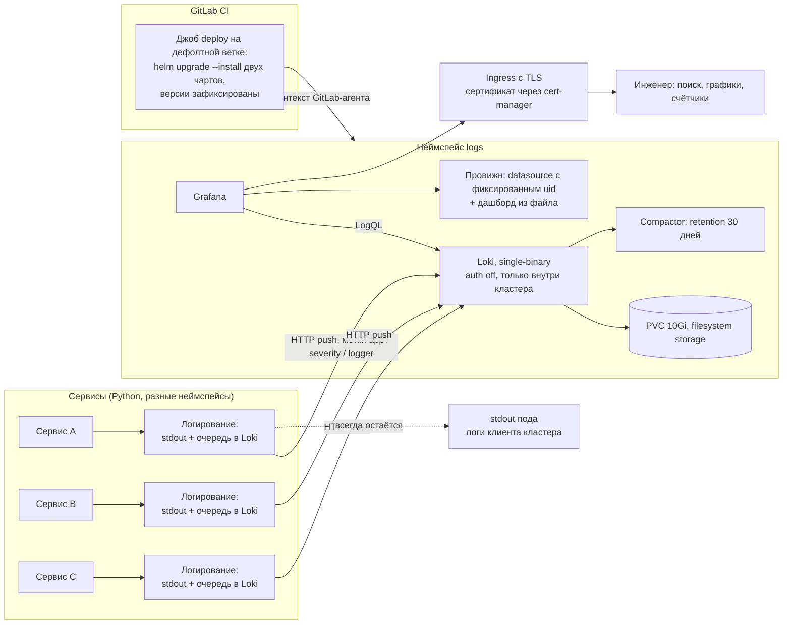

# Централизованные логи для группы сервисов: Loki + Grafana в namespaced-кластере

Кейс-стади: инфраструктурный репозиторий и клиентская библиотека логирования, которые дали
пяти-шести небольшим сервисам общий поиск по логам — при том что прав уровня кластера у
команды не было. Заказчик обезличен, боевые адреса и домены не приводятся.

## Коротко

- **Задача:** логи нескольких сервисов жили только в выводе контейнера и пропадали при перезапуске. Нужен общий поиск по логам с историей, без прав администратора кластера.
- **Решение:** Loki и Grafana в собственном неймспейсе. Сервисы сами отправляют логи по HTTP через неблокирующую очередь стандартного Python logging, стек деплоится одним джобом GitLab CI через Helm.
- **Стек:** Grafana Loki, Grafana, LogQL, Python logging (QueueHandler), Kubernetes, Helm, GitLab CI, cert-manager.
- **Результат:** хранение 30 дней, дашборд с фильтрами по сервису и уровню, единый клиентский код логирования во всех сервисах. Недоступность Loki не влияет на обработку запросов. Метрика «время разбора инцидента до и после» не фиксировалась.
- **Моя роль:** инфраструктурный репозиторий (values чартов, дашборд, CI-джоб, документация) и клиентская часть логирования в сервисах, в ограничениях платформенной команды заказчика.

## 1. Задача и контекст

К моменту задачи в кластере работали несколько независимых Python-сервисов (чат-консультант,
пайплайн дайджестов, модерация комментариев, подбор учебных треков, бот поддержки). Логи
существовали только как поток stdout контейнера. Практические следствия:

- посмотреть логи можно было лишь через клиент кластера и только пока жив под;
  RollingUpdate или падение — и история потеряна;
- разбор инцидента «когда началось и что было до этого» упирался в отсутствие истории;
- нельзя было ответить на простой вопрос «сколько ошибок за ночь и у какого сервиса»;
- инженеру приходилось помнить неймспейсы и имена подов вместо того, чтобы искать по тексту.

Ограничения, которые определили решение целиком:

- **нет прав cluster-admin.** Деплой строго в свой неймспейс, объекты уровня кластера
  (ClusterRole, DaemonSet на все узлы) создать нельзя. Это сразу исключило стандартную
  схему сбора логов агентом на каждом узле;
- нет отдельного бюджета на внешний SaaS-логгер и нет объектного хранилища в контуре;
- нагрузка небольшая: несколько сервисов по одной-двум репликам. Разворачивать
  распределённую конфигурацию хранилища логов было бы несоразмерно;
- проблемы с логами не должны создавать проблемы с сервисами: сбор логов — вспомогательная
  функция, она не имеет права ронять или подвешивать обработку запросов.

## 2. Архитектура

## 3. Стек

| Слой | Технологии |
|---|---|
| Хранилище логов | Grafana Loki, режим single-binary (monolithic), схема индекса TSDB, `filesystem` storage на PVC, retention 30 дней через compactor |
| Визуализация | Grafana, provisioning datasource и дашбордов из файлов |
| Транспорт | HTTP push из приложения (клиентская библиотека для Loki), без агента на узлах |
| Клиентская часть | стандартный `logging` Python: `QueueHandler` с ограниченной очередью + `QueueListener` в фоновом потоке |
| Оркестрация | Kubernetes, namespaced RBAC, nodeSelector и tolerations, requests/limits для обоих компонентов |
| Деплой | GitLab CI: собственный джоб (не Auto DevOps) с `helm upgrade --install` двух официальных чартов, версии чартов зафиксированы, аутентификация через GitLab-агент |
| Секреты | пароль администратора Grafana — только masked/protected CI-переменной, передаётся флагом установки; в values не хранится |
| Запросы | LogQL: агрегации `count_over_time` по метке сервиса и уровню, регэксп-фильтр по тексту |

## 4. Инженерные решения и trade-off'ы

**1. Push из приложений вместо агента на узлах.**
Каноническая схема — агент-сборщик на каждом узле, который читает файлы логов контейнеров.
Она требует прав уровня кластера, которых нет. Поэтому логи отправляют сами приложения:
меньше подвижных частей, ничего не нужно согласовывать с администраторами кластера, метки
формирует сам сервис (он лучше знает своё имя и структуру логгеров). Осознанная плата:
логи приходят **только от инструментированных сервисов** — сторонний контейнер в кластере
в Loki не попадёт, и падение процесса до инициализации логирования тоже. Именно поэтому
stdout-обработчик остаётся всегда: базовый способ посмотреть логи пода не отбирается ни у
кого, а push — дополнение, а не замена.

**2. Логирование не имеет права блокировать приложение.**
Отправка идёт через ограниченную очередь (1000 записей) и фоновый поток-слушатель.
Обработчик очереди переопределён так, чтобы при переполнении **дропать запись**, а не
ждать и не бросать исключение: недоступный или тормозящий Loki не должен превращаться в
задержку в обработчике HTTP-запроса. Отдельная тонкость: штатная реализация `prepare()`
форматирует запись своим форматтером и подменяет сообщение готовой строкой — тогда время и
уровень попали бы в **текст**, хотя Loki хранит их отдельно. Слушатель живёт в том же
процессе, сериализация не нужна, поэтому запись передаётся как есть.

**3. Метки против текста.**
Имя сервиса, уровень и имя логгера уходят метками, а в тело строки не дублируются: по
меткам работают фильтры LogQL, а дублирование раздувало бы объём и мешало бы поиску по
существу сообщения. При этом на stdout формат остаётся полным (время, уровень, логгер,
сообщение) — там метки взять негде. Компромисс осознанный: набор меток намеренно узкий,
чтобы не разгонять кардинальность серий (в Loki это главный источник проблем с
производительностью).

**4. Single-binary + файловое хранилище, а не распределённая конфигурация.**
На объёме нескольких небольших сервисов распределённый режим означал бы дюжину лишних подов
без выигрыша. Поэтому: один экземпляр, фактор репликации 1, хранение на PVC, а компоненты
для масштабирования (read/write/backend) обнулены. Отключены кэши чанков и результатов,
canary, самомониторинг и nginx-шлюз — приложения пишут напрямую во внутренний сервис.
Объектное хранилище и встроенный minio не используются. Плата за простоту прямая и
понятная: единственная точка отказа сбора логов, ограничение объёма размером тома и
retention 30 дней. Для вспомогательной подсистемы это правильный размен, и он записан в
values комментариями, чтобы следующий человек не ломал голову.

**5. Дашборд как код, но с сохранением правок из интерфейса.**
Дашборд лежит в репозитории и провижнится из файла; uid источника данных зафиксирован,
иначе автогенерированный uid менялся бы при каждом редеплое и панели теряли бы связь с
источником. При этом обновления из интерфейса разрешены: правки, сделанные в браузере,
переживают редеплой, а провижнинг перезапишет дашборд только если версия в файле больше
сохранённой. Это компромисс между «инфраструктура как код» и живой работой: инженер
подкручивает панель на ходу и не теряет её, но чтобы изменения из репозитория приехали,
версию в файле нужно поднять — и это прямо задокументировано.

**6. Собственный CI-джоб вместо шаблонного пайплайна.**
Остальные проекты деплоятся стандартным шаблонным пайплайном «один образ — один чарт». Здесь
нужно поставить стек из двух официальных чартов, поэтому джоб написан руками: образ с
Helm и клиентом кластера, идемпотентное создание неймспейса, добавление репозитория чартов,
`helm upgrade --install` для каждого чарта с ожиданием готовности и таймаутом. Версии
чартов зафиксированы явно — обновление стека становится осознанным коммитом, а не
случайностью очередного деплоя. Дефолтные джобы шаблона не подключены, поэтому и переменных
для их отключения не требуется.

## 5. Что было сложно

- **Контекст кластера нужно выбирать явно.** Аутентификация идёт через GitLab-агент, но
  сам агент не делает свой контекст текущим: без явного переключения клиент кластера
  молча идёт на локальный адрес и падает с непонятной ошибкой соединения. Одна строка,
  которая стоила отладочного цикла.
- **Ingress чужого чарта не делает то же, что «наш» чарт.** В прикладных сервисах
  шаблонный чарт сам ставит аннотацию для выпуска сертификата и TLS-блок. У чарта Grafana
  этого поведения нет — без явной аннотации и секции TLS ingress отдаёт собственный
  самоподписанный сертификат, и в браузере всё выглядит как ошибка конфигурации домена.
  Пришлось прописать это руками и объяснить в комментарии, чем этот случай отличается.
- **Retention включается не одним флагом.** Актуальная мажорная версия Loki требует
  указать хранилище запросов на удаление, когда включён compactor-retention; без него
  компонент не стартует. Такие «сопряжённые» настройки — самая частая причина, по которой
  чужой чарт не поднимается с виду корректными values.
- **Что считать «уровнем».** Чтобы графики ошибок работали, уровень должен быть меткой с
  предсказуемым набором значений, а не подстрокой сообщения. Панели построены на
  агрегациях по метке уровня (ошибки и предупреждения отдельно), а свободный поиск сделан
  регэксп-фильтром поверх — компромисс между удобством и кардинальностью.
- **Пароль администратора.** Единственный секрет стека не должен лежать в values в
  репозитории: он приходит из masked/protected CI-переменной и передаётся установщику
  флагом. Мелочь, но именно такие мелочи утекают в git.

## 6. Результат

Подтверждаемое конфигурацией репозитория:

- Развёрнутый стек логов в собственном неймспейсе без каких-либо прав уровня кластера:
  хранилище логов не выставлено наружу, снаружи доступна только Grafana по HTTPS с
  сертификатом от cert-manager.
- Хранение логов 30 дней на томе 10Gi, requests/limits заданы для обоих компонентов,
  лишние компоненты стека отключены осознанно и с комментариями.
- Готовый дашборд «логи сервисов» с переменными «сервис», «уровень» и «строка поиска»:
  объём логов по сервисам во времени, счётчик ошибок за выбранный период, число пишущих
  сервисов, график ошибок и предупреждений по сервисам, детализация по выбранному сервису и
  панель самих логов с регэксп-поиском.
- Единый клиентский код логирования, переиспользуемый во всех сервисах: stdout всегда плюс
  опциональный push (включается одной переменной окружения — без неё приложение работает
  как раньше, что удобно локально и в тестах).
- Неблокирующий путь логирования: ограниченная очередь, фоновый поток, дроп при
  переполнении — недоступность подсистемы логов не влияет на обработку запросов.
- Деплой одной командой из CI на дефолтной ветке, версии чартов зафиксированы, секрет
  вне репозитория.

Численных показателей (объём логов в сутки, время разбора инцидента до и после) не
привожу: они не фиксировались, а придумывать «ускорили разбор инцидентов на N%» я не буду.

## 7. Роль в проекте

Инфраструктурный репозиторий (values обоих чартов, дашборд, CI-джоб деплоя,
документация по переменным и домену) и клиентская часть логирования в прикладных сервисах —
неблокирующий обработчик, схема меток, единый формат. Ограничения контура (namespaced RBAC,
группы узлов, taint'ы, wildcard-сертификат на ingress-контроллере, схема аутентификации CI
в кластер) заданы платформенной командой заказчика — я работал внутри них: собственно
поэтому и получилась схема с push из приложений вместо стандартного агента-сборщика.
