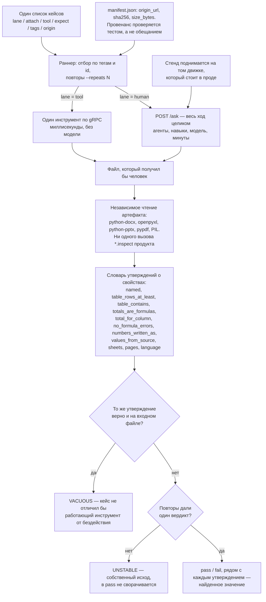

# Приёмочный стенд для агентной платформы: вердикт по файлу, который получил пользователь

Кейс-стади: приёмочный контур продукта, который по просьбе человека делает документы.
Стенд открывает полученный файл независимыми библиотеками и отвечает на единственный
вопрос — получил ли человек то, что просил. Заказчик обезличен, исходный код не
публикуется.

## Коротко

- **Задача:** платформа по просьбе пользователя готовит документы, а прежняя приёмка проверяла внутренние события продукта и пропускала дефекты, видные при открытии файла. Нужна приёмка по самому файлу.
- **Решение:** единый стенд с двумя дорожками (один инструмент по gRPC и полный ход через API) и одним отчётом. Файл открывается независимыми библиотеками, вердикт выносится по утверждениям о его свойствах. Кроме pass и fail есть исходы «кейс ничего не измерил» и «повторы разошлись».
- **Стек:** Python 3.12, gRPC, protobuf, python-docx, openpyxl, python-pptx, pypdf, Pillow, pytest, Docker Compose.
- **Результат:** 107 кейсов на 16 семейств форматов, корпус из 62 реальных русских документов с проверяемым провенансом, покрыт 81 навык из 86. Стендом найдены и починены реальные дефекты продукта. Сравнимого замера «до» нет, поэтому цифры «качество выросло на N%» в кейсе отсутствуют.
- **Моя роль:** приёмочный контур целиком: стенд, сюита, корпус, оракулы. За 11–28 августа 2026 третий по числу коммитов из пяти контрибьюторов. Архитектура продукта командная.

## 1. Задача и контекст

Продукт — агентная платформа: человек присылает просьбу и, как правило, файл, платформа
выбирает из каталога подходящий навык и возвращает готовый документ — договор с правками,
смету, презентацию, PDF. Каталог на момент работы — 109 инструментов и 110 навыков,
16 семейств форматов, включая legacy (`.doc`, `.xls`, `.rtf`, `.ppt`) и сканы без
текстового слоя.

Приёмка существовала, но отвечала не на тот вопрос. Её вердикт собирался из событий хода
и эвристик по ответу модели: инструмент отработал, шаг завершился, ответ выглядит
уместным — значит зелено. Ни один из дефектов, пришедших в ту неделю от живых
пользователей, так не виден: имя файла, которое ответ проигнорировал; целые числа,
опубликованные как `2.0`; таблица, сплющенная конверсией в абзацы; формулы, заменённые
руками набранными цифрами; свод по другому листу, отклонённый как циклическая ссылка;
документ, возвращённый пустым. Каждый из них очевиден в ту секунду, когда файл открывают.

Отдельная, более неприятная часть задачи: **продукт верифицировал сам себя своим же
кодом.** Запись документа и его чтение шли одной библиотекой через одни и те же
внутренние `*.inspect`-инструменты. Колонка, потерянная при записи, не видна и при
чтении — дефект маскирует сам себя, и оба места остаются зелёными. Проверять продукт
продуктом здесь означало гарантированно не найти тот класс ошибок, ради которого приёмка
и заводится.

Ограничения:

- вердикт должен относиться к артефакту, а не к внутреннему состоянию агента: всё, что
  можно узнать, не открывая файл, уже проверялось и ничего не ловило;
- ход, который ведёт модель, невоспроизводим дословно — утверждение о свойстве переживает
  повторный прогон, утверждение о конкретном тексте нет;
- девять отдельных сьют, у каждой свой раннер и свой отчёт, были главной причиной, по
  которой прежний харнесс всегда требовал починки; новый контур обязан быть один;
- синтетика не годится как корпус: на ней интересующие дефекты не воспроизводятся;
- корпус нельзя раздувать и нельзя раздавать: часть реальных документов несёт чужие
  персональные данные.

## 2. Архитектура

## 3. Стек

| Слой | Технологии |
|---|---|
| Язык | Python 3.12 |
| Связь с продуктом | gRPC по protobuf-контрактам (инструментальная дорожка), REST `POST /ask` с SSE (полный ход) |
| Чтение артефактов | python-docx, openpyxl, python-pptx, pypdf, Pillow — напрямую, в обход инструментов продукта |
| Фикстуры | реальные документы байт-в-байт; пересборка контейнеров через LibreOffice, большие PDF — reportlab |
| Описание кейсов | Python-DSL → генерация `cases.json`; jsonschema и Pydantic на контрактах; цепочка ожидаемых инструментов выводится из манифестов навыков, а не пишется руками |
| Изоляция прогона | отдельный compose-проект со своими портами на `127.0.0.1`, чтобы стенд стоял рядом с работающим dev-контуром, а не вместо него |
| Отчёт | `report.html`, `report.json`, `junit.xml`, артефакты и логи сервисов в каталоге по временной метке |
| Проверки | pytest (харнесс проверяется без сети и без модели), ruff, mypy |

## 4. Инженерные решения и trade-off'ы

**1. Вердикт смотрит внутрь файла и смотрит чужими глазами.**
Каждый артефакт открывается голыми форматными библиотеками и никогда — собственными
`*.inspect` продукта. Это прямое следствие диагноза из первого раздела: баг в чтении
маскирует баг в записи, и оба остаются зелёными. Плата понятна и принята: стенд дублирует
часть работы продукта и обязан знать форматы сам. Зато красный кейс означает, что
изменился продукт, а не что два его куска договорились между собой.

**2. Утверждения описывают свойства, а не байты.**
Ход, который ведёт модель, нельзя повторить дословно. «В смете остались четыре позиции,
которые я дал, а итог — формула» переживает повторный прогон; «в документе написано ровно
это» — нет. Отсюда весь словарь утверждений: он собран так, чтобы читаться как сама
просьба, и каждое утверждение печатает рядом найденное значение — вердикт проверяется за
десять секунд, а не открыванием артефакта руками.

**3. Зелёный, который ничего не доказал, — отдельный исход.**
Каждое утверждение прогоняется ещё и по входному файлу. Если вход отвечает так же, кейс
не отличил бы работающий инструмент от бездействия, и он помечается `VACUOUS`, а не
складывается в `pass`. Утверждения о том, что должно **пережить** работу, живут в
отдельной секции, где этот сторож выключен намеренно. На первом же прогоне механизм
отметил два моих собственных кейса как не проверяющие ничего.

**4. Кейс, дающий разные вердикты между прогонами, — провал, а не удача.**
Одна просьба, четыре прогона, четыре поведения: успех один раз и три разных отказа. Любой
единичный прогон из этих четырёх выглядел бы убедительно, и от того, какой достался,
зависел вывод о продукте. Режим повторов гоняет выбранные кейсы N раз: согласные прогоны
сохраняют свой вердикт, несогласные делают кейс `unstable` — собственный исход, который в
`pass` не сворачивается и валит прогон. Тонкость, без которой механизм не работает: номер
попытки обязан доходить до ключа идемпотентности и до идентификатора беседы, иначе
инструментальная дорожка переигрывает первый вызов, а полная читает историю прошлой
попытки, и самый нестабильный кейс отчитывается как идеально стабильный. Флакующий тест
хуже отсутствующего: отсутствующий хотя бы честно молчит.

**5. Оракулы затачивались против правдоподобно неверного результата.**
Проверка, отклоняющая только явный сбой, бесполезна — сбой виден и так. Поэтому каждая
предъявлялась артефакту, который **прошлый прогон засчитал**, и обязана была его
отвергнуть: склейку, выданную за соединение по ключу; части разбиения, унёсшие чужие
разделы; выгрузку листа, неотличимую от выгрузки не того листа; объединение в произвольном
порядке; отказ, тихо опубликовавший два файла; неизменённый файл, названный обновлённым;
девятнадцать одинаковых диаграмм; презентацию, всё ещё несущую адрес из шаблона.

**6. Негативный кейс запрещает утверждение, а не слово.**
Запрещённый фрагмент — почти всегда фрагмент самого вопроса, и честный отказ по существу
обязан его процитировать: «В данном договоре отсутствует пункт о штрафе в размере 500 000
рублей» — правильный ответ, а проверка «в тексте не должно встречаться 500 000» его
заваливает (так и произошло, три кейса в живом прогоне). Поэтому в словаре есть отдельное
утверждение «не заявляет»: оно игнорирует фрагмент, стоящий внутри явного отрицания в
своём предложении, и в сомнительном случае склоняется к строгой стороне. Простой запрет
подстроки остался для случаев, когда строки не должно быть вовсе, что бы её ни окружало.
Запрет на слово, а не на утверждение, обходится синонимом и потому не запрет.

**7. Недостижимый порог — дефект кейса, а не продукта.**
Кейс требовал сохранности 0.75 над файлом, где заменить надо термин из 39 строк из 131:
корректная правка сохраняет ровно 92/131 = 70%, и порог не брался никакой работой. Кейс
был красным по построению, а его краснота ничего не измеряла. Порог взят из арифметики
самого файла — 0.70, то есть все 92 строки без термина обязаны дожить дословно, — и рядом
поставлена полоса на число изменённых строк: меньше — правка неполная, больше — документ
пересобрали. Свидетель написан общий, а не под один кейс: он сам считает по файлу, сколько
строк несут запрещённый фрагмент, и валит любой порог сохранности выше остатка.

**8. Стенд гоняет тот же движок, что и прод.**
Стенд поднимался с пустой переменной режима планирования, то есть на детерминированном
движке, а человек приходит на прод, где стоит петлевой. Слой e2e сбрасывает эту переменную
нарочно — ему она нужна для сравнения двух движков на одной сьюте. Но стенд отвечает на
другой вопрос, «что получит человек», и зелёное на движке, которого на проде нет, про
человека не говорит ничего. Так и прошли мимо заслона, который стоял только на
детерминированном пути и на проде не существовал вовсе. Теперь по умолчанию идёт продовый
режим, значение по-прежнему перебивается снаружи, а отдельный тест сверяет конфигурацию
стенда с конфигурацией прода.

**9. Одна таблица кейсов вместо девяти сьют.**
Дорожка — свойство кейса, а не отдельная сюита: инструментальная гоняет один инструмент по
gRPC за миллисекунды и доказывает контракт, полная гоняет весь ход, стоит минуты и
доказывает то, что получает человек. Отбор — теги и идентификаторы на одном списке,
никогда не новая сюита. У каждого кейса есть поле с коммитом или жалобой, ради которых он
существует, — красный кейс трассируется до причины.

## 5. Что было сложно

- **Корпус на реальных документах.** Синтетическая фикстура не несёт объединённых ячеек,
  листа шириной в 16 000 колонок, скана без текстового слоя и формулы-самопроверки,
  которую бухгалтер оставил под подписью «проверка:». Именно последняя, в настоящей смете
  НИР, и делала документ нередактируемым. Корпус собран из публикаций ведомств, вузов и
  открытых проектов: файлы лежат байт-в-байт, у каждого записаны источник, `sha256` и
  размер, провенанс проверяется тестом. Байт-в-байт — не педантизм: пересохранение файла
  чужим редактором обнуляет доказательство происхождения, и красный кейс перестаёт значить
  «продукт изменился». Настоящих русских `.odt`, `.ods`, `.odp` и `.ppt` найти не удалось —
  пять фикстур из шестидесяти двух пересобраны конвертацией из реального исходника, и тест
  следит, чтобы структура входа (38 формул, 15 слайдов, две таблицы) не разошлась с тем,
  что требует кейс.
- **Персональные данные в реальном корпусе.** Реестр с ФИО и ИНН и отчёт с блоками
  электронной подписи в набор не попали, хотя и опубликованы. Имена должностных лиц в
  свойствах файлов остались — их нельзя вычистить, не сломав `sha256`. Для второго,
  «спросового» списка сорок один документ вынесен за пределы репозитория совсем: клон
  проекта не должен раздавать всем копию чужой анкеты с паспортными данными. Каталог
  пересобирается из lock-файла с идентификаторами, размерами и хэшами, и файл с
  разъехавшимся хэшем отвергается.
- **Первый живой прогон выявил десяток дефектов у самого набора.** Из шестнадцати кейсов
  смоук-прогона шесть падений были продуктовыми и остались красными, а десять — набор мерил
  собственные неверные допущения: пять кейсов ждали маршрут навыка, который в этом сценарии
  физически не исполняется; три требовали SVG, не попросив формат в самой просьбе; один
  требовал 150 символов ответа там, где правильный ответ укладывается в 104 и единственный
  способ добрать до порога — вода. Переписывались кейсы. Подгонять под них продукт — способ
  получить зелёную приёмку и красный прод.
- **Проверка формул читала кэш значений.** Книга уезжала пользователю с итогом вида
  `SUM(Бюджет!#REF!:#REF!)` — колонка, которую суммировал свод, была удалена, — а стенд
  называл её чистой. Причина: проверка смотрела только кэшированные значения, а ни одна
  книга, которую делает эта система, кэша значений не имеет — Excel её не открывал, и для
  каждой формулы читается `None`. `#REF!` потерянной ссылки значением не становится вовсе:
  это текст формулы, и он остаётся там при следующем открытии, потому что пересчитывать
  нечего. Теперь читаются обе стороны, и два дефекта остаются различимыми: кэшированное
  `#VALUE!` — формула выполнилась и упала, токен в тексте формулы — адреса больше нет.
- **Привязка к машине автора.** Гейт проверки харнесса падал на любой машине, кроме той,
  где набор писали: путь к офисному датасету был зашит в чужой домашний каталог, а шрифты
  искались только по одному дистрибутивному пути. Отдельно: побайтовая сверка PNG со свежей
  сборкой непортируема — байты deflate зависят от версии zlib, с которой собран Pillow, — и
  переведена на сравнение декодированного содержимого.

## 6. Результат

Проверяемое по коду репозитория:

- Единый стенд: один список кейсов, две дорожки, один отчёт. Вердикт выносится по
  артефакту, прочитанному независимыми библиотеками; рядом с каждым утверждением
  печатается найденное значение.
- Три исхода сверх `pass`/`fail`, каждый из которых закрывает свой способ самообмана:
  `VACUOUS` (кейс ничего не мерил), `unstable` (разные вердикты между повторами) и
  отдельная корзина для кейсов с внешней зависимостью — без ключей и сети они не
  засчитываются в регрессии продукта.
- Приёмочная сюита на реальных русских документах: 107 кейсов, 16 доменных семейств,
  корпус из 62 файлов на 24 МБ с проверяемым провенансом; покрыт весь исполняемый
  каталог — 81 навык из 86, остальные пять исполняются отдельными агентами и мерятся иначе.
  Тест падает и на навыке без кейса, и на фикстуре без кейса, и на кейсе, подцепившем
  фикстуру вне русского корпуса.
- Второй список — про спрос, а не про регрессии: 60 кейсов, сформулированных целью на языке
  человека («вычитай, он идёт на подпись», «где я рискую как арендатор») и никогда
  операцией; отдельный тест валит просьбу, называющую инструмент. Тринадцать кейсов
  проверяют, что продукт чего-то **не** делает: не подписывает картинкой и не называет это
  квалифицированной подписью, не выдумывает отсутствующий пункт договора, не «обезличивает»
  закрашиванием поверх живого текста. Итог — взвешенная доля пройденного с релизным
  правилом: общая доля не должна падать, и ни один класс весом от 10 не должен уходить
  назад. Вердикт по этому списку ставит читающий человек: механическая проверка докажет,
  что фамилия исчезла из текста, метаданных и свойств документа, но не скажет, осталась ли
  обезличенная анкета пригодной анкетой.
- Найденное стендом и починенное: свод по другому листу, отклонённый как циклическая
  ссылка; нередактируемая смета, где сравнение читалось как итог, а две маржи перекрёстной
  таблицы — как двойной счёт; потерянная ссылка в формуле итога. Отдельно висит открытая
  находка полной дорожки: «общий итог», суммирующий количества и цены за единицу и
  оставляющий колонку суммы без итога.
- Харнесс проверяется сам: его тесты идут без сети и без модели, конфигурация стенда
  сверяется с конфигурацией прода, снимок покрытия каталога обновляется только явно и
  падает на расхождении.

Чисел вида «стенд поднял качество продукта на N%» не привожу: сравнимого замера «до» не
существует — прежняя приёмка мерила другой предмет, и сопоставление с ней было бы
арифметикой над несопоставимым.

## 7. Роль в проекте

Приёмочный контур — моя зона: единый стенд (раннер, независимое чтение артефактов, словарь
утверждений, дорожки, повторы, отчёт), приёмочная сюита на русском корпусе с манифестом и
провенансом, взвешенный список спроса с его lock-файлом и правилом релиза, оракулы и их
заточка против правдоподобно неверного результата, снятие привязки к машине автора, сверка
режима стенда с продом. За 11–28 августа 2026 — 332 коммита из 1171 в основном
репозитории, третий контрибьютор из пяти; приёмка и оракулы — 39 коммитов, стенд — 7,
остальное приходится на продуктовые части, разобранные в соседнем кейсе.

Архитектура самого продукта (оркестратор, разделение инструментов и навыков, контракты
protobuf) — командная и досталась мне готовой; конвенции compose и CI — платформенные.
Корпус, кейсы и правила вердикта — мои, и часть из них написана после того, как первый
живой прогон доказал, что предыдущая версия этих же правил мерила не то.
