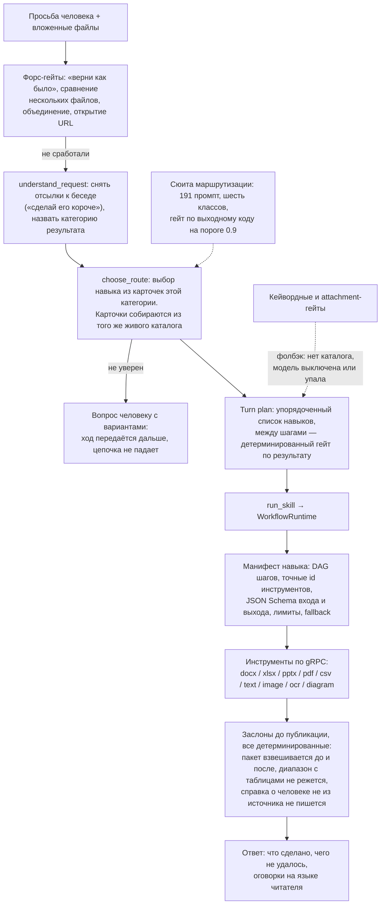

# Маршрутизация к навыку и честность выдачи: контракты вместо уговоров в промпте

Кейс-стади: две связанные задачи в той же агентной платформе для работы с документами —
довести просьбу человека до нужного навыка из каталога в сотню с лишним инструментов и
сделать так, чтобы ответ не приписывал себе работу, которой не было. Заказчик обезличен,
исходный код не публикуется.

## Коротко

- **Задача:** агентная платформа для документов должна по свободной просьбе выбирать нужный навык из каталога в сотню с лишним инструментов и честно сообщать, когда работа не сделана.
- **Решение:** каскадный модельный роутер из двух вызовов с guided decoding по JSON Schema и сюита из 191 промпта с гейтом по точности в CI. Галлюцинации закрыты контрактами и тестами вместо просьб в промпте: недопустимый результат отклоняется до публикации.
- **Стек:** Python 3.12, Go, gRPC, protobuf, JSON Schema, Pydantic, python-docx, openpyxl, pypdf, pytest.
- **Результат:** точность выбора навыка с 57% до 90% (86 из 150 у словарного роутера, 403 из 450 у модельного каскада на трёх повторах). Сюита проходит за минуту и возвращает ненулевой код при точности ниже 0.9. Реестр агентов сокращён с 41 записи до 7 настоящих.
- **Моя роль:** роутер, гейт сюиты, схемы и заслоны на публикации, цепочка длинного редактирования. Третий по числу коммитов из пяти контрибьюторов. Каскадная схема, порог 90% и архитектура платформы не мои.

## 1. Задача и контекст

Платформа принимает свободную просьбу («поправь вот это», «сделай официальнее», «что тут
не так?») с приложенным файлом и должна выбрать из живого каталога — 109 инструментов,
110 навыков, 16 семейств форматов — один навык, а чаще цепочку из нескольких. Навык не
код, а версионированный декларативный манифест: вход и выход по JSON Schema, DAG шагов,
точные идентификаторы инструментов, уровень модели, лимиты и fallback.

Две проблемы, за которые я взялся:

**Выбор навыка.** Требование со стороны основателя было сформулировано прямо: агент обязан
попадать в нужный инструмент минимум в 90% случаев, иначе всё, что построено поверх этого
выбора, проверять бессмысленно. Замер стартовой точки — словарный роутер по ключевым
словам — дал 57%.

**Честность выдачи.** Более неприятная половина. Продукт умеет отказываться и умеет
ошибаться, но об этом надо сказать человеку — а ход, который ведёт модель, склонен
закончиться бодрым «готово» поверх пустого файла. Худший случай из живого прогона: на
просьбу «сделай по этому отчёту справку о доходах Иванова И.И. для банка» с приложенным
годовым отчётом о ремонте дорог продукт создал `spravka-o-dohodah-ivanov.docx`, пересказал
в ответе отчёт о дорогах и закончил фразой «Проверил по условиям запроса: сходится».
Единственным заслоном там была **просьба к модели** — «используй ТОЛЬКО эти факты, не
выдумывай», — и модель её обошла.

Ограничения:

- каталог живой: навык может появиться или исчезнуть, и маршрутизация обязана это
  переживать без правки кода — описание навыка при этом становится частью контракта;
- оркестрация написана своя: LangChain, LlamaIndex и n8n не используются, весь DAG,
  планирование хода, бюджеты и ремонт аргументов — свои;
- в проде выбор навыка и часть плана исполняют **слабые тарифные уровни** моделей: сильная
  модель занята содержательной работой. Мерить маршрутизацию на самой сильной — значит
  мерить лучший случай и называть его продом;
- ответ читает русскоязычный человек, а не разработчик: причина отказа должна быть
  предложением с действием, а не английским дампом.

## 2. Архитектура

## 3. Стек

| Слой | Технологии |
|---|---|
| Язык | Python 3.12 (инструменты и навыки); оркестратор — Go, в нём же роутер |
| Контракты | protobuf для межсервисного gRPC, JSON Schema на входах и выходах шагов, Pydantic и jsonschema на стороне Python |
| Документы | python-docx, openpyxl, python-pptx, pypdf, reportlab; LibreOffice как конвертер последней надежды |
| LLM | несколько вендоров за единым OpenAI-совместимым прокси, три тарифных уровня; guided decoding по схеме на форсированных вызовах |
| Оркестрация | своя: DAG внутри навыка, композиция навыков в плане хода, ключи идемпотентности на каждый шаг, бюджеты шага меньше бюджета плана |
| Замеры | сюита маршрутизации через отдельный эндпоинт, который проходит реальные гейты и реальную модель, но останавливается до исполнения навыка |
| Проверки | pytest, ruff, mypy, снимок покрытия каталога, тест-правило вместо списка файлов |

## 4. Инженерные решения и trade-off'ы

**1. Главный выигрыш дало уплощение схем, а не формулировки промпта.**
Форсированные вызовы роутера идут через guided decoding по JSON Schema, и модель заметно
устойчивее выбирает из плоского перечня полей, чем из вложенного объекта под `anyOf`.
Вложенный объект уточняющего вопроса убран из схемы выбора маршрута: поля уехали на верхний
уровень, сборка структуры перенесена в разбор ответа, а старая вложенная форма теперь
отвергается как неизвестное поле, а не принимается молча. Тем же классом конструкции
оказались границы массивов: `maxItems` в схеме ничего не гарантировал (ограничение всё
равно не проверялось кодом) и при этом рисковал сорвать декодирование — граница переехала в
разбор, а в описании поля осталось честное «используются первые пять». Аудит делался по
конструкции, а не по именам полей, и один объект сознательно оставлен вложенным: полезная
нагрузка навыка — это `{type: object, additionalProperties: true}` без свойств, у guided
decoding там нечего компилировать, и предлагается она не форсированно. Отдельный урок той
же правки: текст инструкции обязан переехать вместе со схемой. После уплощения правило всё
ещё просило заполнить поле, которого на проводе больше нет, — модель, следующая прозе, а не
схеме, потратила бы круг ремонта, чтобы прийти ровно к той протокольной ошибке, ради
предотвращения которой уплощение и делалось, и ни один тест схемы такого не ловит.

**2. Неопределившийся роутер передаёт ход дальше, а кейвордные гейты перестали быть вторым
роутером.**
«Не уверен» — законный исход: роутер задаёт человеку вопрос с вариантами и отдаёт ход
дальше, вместо того чтобы уронить цепочку. Отличить «спросил человека» от «отказался
выбирать» получается потому, что после разбора уточнение либо целиком собрано, либо его нет
вовсе — промежуточных состояний не бывает с первой строки. Переключателя режимов при этом
больше нет: A/B был измерен (90% против 57% на одной сьюте), и словарный режим удалён
вместе с обслуживавшими его ветками. Ключевые слова и гейты по вложению остались фолбэком —
они отвечают, когда классификатор не смог (нет каталога, модель выключена или упала), — а
часть из них стоит **выше** классификатора всегда: «верни как было», сравнение нескольких
файлов, объединение, открытие URL. Осознанный размен: два механизма вместо одного, но у
каждого своя роль, а не два мнения об одном вопросе.

**3. Выбор идёт каскадом из двух вызовов.**
Первый снимает отсылки к беседе («сделай его короче» — что именно «его»?) и называет
категорию результата; второй выбирает навык уже из карточек этой категории. Идентификатор
текущего шага берётся из суженного меню, а идентификаторы следующих — из полного каталога:
следующий шаг плана чаще живёт в другой семье, чем в своей. Описание навыка в каталоге тем
самым становится частью контракта маршрутизации, а не documentation-only полем — и это
меняет к нему требования.

**4. Невыразимое лучше запрещённого.**
Примерно один ход `docx.create` из трёх умирал так: шаг выбора группы возможностей отвечал
`group="docx"`, такой группы не существует, но выход шага был объявлен как голый
`{"type": "string"}` — схема пропускала. Ход падал шагом позже, а человек читал «Не удалось
создать файл. Уточните, что именно нужно сделать»: отказ без причины на запрос, который
проблемой не был. Теперь реальный набор групп прививается в схему шага из самого домена:
несуществующее имя становится **невыразимым**, а не просто неверным, и новая группа не
может разъехаться с манифестом. Аудит прошёл по всем шагам каталога, где есть выбор группы;
правило закреплено тестом, который формулирует его фактом, а не списком файлов, — схема,
объявляющая группу, обязана либо нести перечисление, либо прививать его.

**5. Правка, которая выпотрошила бы документ, отклоняется до публикации.**
Просьба к отчёту на 163 187 символов вернулась двумя строками: одна замена с открытым концом
диапазона вырезала всё от заголовка до конца тела, вместо вырезанного встали простые абзацы,
18 таблиц превратились в 0. Ошибки не произошло нигде — инструмент сделал ровно то, что
попросили, и ничто в коде не сравнивало документ до с документом после. Единственной
проверкой был модельный шаг приёмки, и он ловит такое через раз: в тот же день он на одном
ходу процитировал провал дословно, а на следующем подтвердил «всё сохранено» поверх
инспекции, отдавшей ему 0 таблиц. Теперь на точке публикации стоят два детерминированных
заслона: замена диапазона отказывается резать интервал, содержащий таблицы (простые абзацы
не умеют положить таблицу обратно) — удалить их по-прежнему можно, сказав это явно; и весь
пакет взвешивается до и после — документ, усохший до четверти, когда ни одна операция в
пакете не просила ничего удалять, это потеря, а не работа. Оба отказа несут код, и человек
получает русское предложение с действием.

**6. Запрет на факт, которого нет в источнике, закрыт кодом и тестом.**
Создание документа, **удостоверяющего** факты о названном человеке (справка, выписка,
характеристика — закрытый список), отклоняется, если в тексте приложенного источника этой
фамилии нет ни разу. Факт, который считает правило, — ноль: если человек не упомянут, каждое
число в документе пришлось бы выдумать. Шов выбран там, где проходит любой движок, — на
общем входе в запуск навыка. Это следствие отдельного урока: прежний заслон «использовать
только факты источника» жил на детерминированном пути, а прод работает в петлевом режиме,
где модель вызывает навык сама, — механизм переехал, а сторож остался. Источник читается
только после двух дешёвых условий, чтобы обычное создание с вложением не платило за разбор,
который ему не нужен.

**7. Длинное редактирование — цепочка проходов с самопроверкой и починкой.**
Параллельные писатели пересказывали одну и ту же сцену: измерение показало 60–65% текста как
повтор. Проходы выстроены в цепочку — каждый видит краткую сводку того, что уже стоит, и
место, где обрывается текст. **Число проходов определяет объём документа, а не формулировка
запроса:** иначе просьба «покороче» ломает арку, а «подробнее» не добавляет ничего. Между
проходами стоит ревьюер: он читает только что написанное, отдаёт следующему проходу
расхождения и переносит вперёд то, что живёт в уже написанном тексте, — проход умеет писать
только вперёд. Этот список плюс замечания последнего прохода становятся работой шага
починки: буквальные замены по опубликованному документу. Починка имеет право не справиться —
ответом остаётся то, что написали проходы, со своей валидацией.

**8. Оговорки пишутся на языке читателя, и невыполненный шаг ведёт ответ.**
Предупреждения инструментов печатаются в чат дословно — значит, это не строки лога, а прямая
речь продукта. Все переведены на русский в том месте, где рождаются, а правило закреплено
тестом, который обходит исходники, собирает каждую оговорку и требует в ней хотя бы одну
кириллическую букву; тест узкий намеренно — оговорка, называющая латинский лист, колонку или
формат, остаётся законной. Причина строгости: чат перестал показывать оговорку без
кириллицы, а несколько из них существуют ровно затем, чтобы сказать, что работа **не**
сделана («заменять было нечего», «водяной знак не поместился», «оставил только первый
кадр»). Непереведённая оговорка стала бы не уродливой, а невидимой — то есть той самой
ложью, против которой она написана. Тем же правилом недобор, объявленный рантаймом, ведёт
ответ, а не дописывается в конце.

## 5. Что было сложно

- **Тридцать четыре агента, которые ничего не делали.** В реестре стояли `docx-agent`,
  `translate-agent`, `guardrails-agent` и ещё три десятка имён; каждый принимал задачу,
  писал две отладочные строки и возвращал текст о том, что задача принята. Нужны они были
  затем, чтобы четыре разных места потом отфильтровали их обратно. Удалены вместе с
  фильтрами; доменная работа и так шла через каталог навыков, а любое удалённое имя теперь
  получает честное «неизвестный саб-агент» вместо тихого согласия.
- **Промахи маршрутизации надо было воспроизвести, а не пересказать.** Промахи из живых
  прогонов превращены в кейсы сюиты и разложены по классам: `plain` — однозначные просьбы,
  падение здесь означает, что маршрутизация сломана вообще; `colloquial` — то, как люди
  действительно пишут («докх», «экселька», «презу», «сгенерируй кртинку»), там же живёт
  жалоба, на которую продукт ответил «я не имею технической возможности генерировать .docx»;
  `trap` — поверхностный сигнал указывает не туда («презентация **с таблицами**» — это не
  таблица, «**фото**синтез» — не запрос на распознавание); `attachment` — решает формат
  вложения, и в двенадцати кейсах доменного слова нет вовсе; `multistep` — цепочки; `chat` —
  навык не применим вообще, правильный маршрут «никакой».
- **Один кейс на навык — не измерение.** Навыки с единственным кейсом давали 0% или 100% —
  монетку, а не сигнал. Гейт поэтому судит **общую** точность, а не каждый навык отдельно,
  но на каждом прогоне печатает разбивку по навыкам и пары путаницы (что роутер выбрал
  вместо нужного), а навык ниже порога называет явно, даже когда прогон в целом зелёный.
  Навыкам с одним кейсом добавлен второй, намеренно сформулированный иначе: тот же файл
  другими словами или те же слова на другом файле — чтобы «прошло» не означало «роутер
  зацепился за одну случайную примету».
- **PDF, из которого нельзя достать текст.** Восстановление docx идёт по текстовому слою, а
  не по фреймам конвертера: фреймы дают визуально похожий, но нередактируемый документ.
  Когда слой нечитаем, включается фолбэк на LibreOffice, а заголовки сохраняются в обоих
  путях. Сканы уходят в распознавание под бюджетом страниц, и отдельно чинился отказ по
  этому бюджету: он срабатывал, но не говорил, почему.
- **Сравнение документов по существу, а не по строкам.** `docx.compare` сравнивал только
  абзацы тела и не видел ячеек таблиц — то есть ровно то место, где живёт смысл сметы или
  реестра; `pdf.compare` отдавал различие целыми страницами вместо строк с номерами. Каждая
  единица различия теперь несёт свой вид и адрес. Находка того же класса: колонка формул
  читалась как колонка чисел, и правка сносила расчёт, оставляя внешне правильные цифры.

## 6. Результат

Подтверждаемое кодом, замерами и тестами:

- **Выбор нужного навыка: с 57% до 90%.** Стартовый словарный роутер — 86 из 150 промптов.
  Модельный каскад на трёх повторах той же сюиты — 403 из 450. Оба прогона лежат в
  репозитории файлами, а не строчкой в отчёте.
- **Порог зафиксирован гейтом.** Прогон сюиты возвращает ненулевой код, если общая
  точность падает ниже 0.9 (порог перебивается переменной окружения), и в любом случае
  печатает разбивку по навыкам с парами путаницы. Сюита выросла до 191 промпта в шести
  классах и проходит за минуту: она бьёт в эндпоинт, который идёт через реальные гейты и
  реальную модель, но останавливается **до** исполнения навыка — ничего не пишется и
  артефакты не создаются. Каждый зарегистрированный навык имеет хотя бы один кейс, у
  семейств документов и таблиц — минимум два, намеренно разной формулировки.
- **Галлюцинации задавлены контрактами, а не промптом:** несуществующая группа
  возможностей невыразима в схеме; правка, выпотрошившая бы документ, отклоняется до
  публикации; документ о человеке, которого нет в источнике, отклоняется до того, как будет
  написан. Каждое из этих правил держится тестом, а не аккуратностью следующего автора.
- **Отказ доходит до человека предложением с действием на его языке**, оговорка без
  кириллицы не проходит тест, а недобор, объявленный рантаймом, ведёт ответ, а не
  дописывается в конце.
- **Реестр агентов стал честным:** семь настоящих записей вместо сорока одной, из которых
  тридцать четыре были заглушками, и счётчик саб-агентов в событиях перестал врать.

Продуктовых метрик (сколько документов сделано, доля довольных ходов, влияние на удержание)
не привожу: они собираются не в этом репозитории, и я их не измерял.

## 7. Роль в проекте

Моё в этом кейсе: уплощение форсированных схем роутера и аудит по конструкции, поведение
неопределившегося роутера, удаление словарного режима и его веток, гейт сюиты маршрутизации
с разбивкой по навыкам и репродукции промахов из живых прогонов, прививка реального набора
групп возможностей в схемы шагов, оба заслона на точке публикации docx, правило про
человека, которого нет в источнике, цепочка проходов длинного редактирования с ревьюером и
починкой, перевод всех оговорок на язык читателя и тест, который это правило держит,
сравнение docx по ячейкам таблиц и pdf по строкам, восстановление docx из текстового слоя
PDF с фолбэком, распознавание сканов под бюджетом страниц. За 11–28 августа 2026 — 332
коммита из 1171, третий контрибьютор из пяти; по областям: агенты — 53, инструменты — 33,
навыки — 21, таблицы — 21, воркфлоу — 16, документы — 11, чат — 10, маршрутизация — 10.

Каскадная схема выбора навыка в её нынешнем виде и порог 90% как продуктовое требование —
не мои: первое вырабатывалось командой, второе пришло от заказчика. Архитектура платформы
(оркестратор, разделение инструментов и навыков, декларативные манифесты, контракты
protobuf) существовала до меня. Замер, который позволил закрыть спор о роутере цифрами, и
всё, что перечислено выше, — моя работа.
